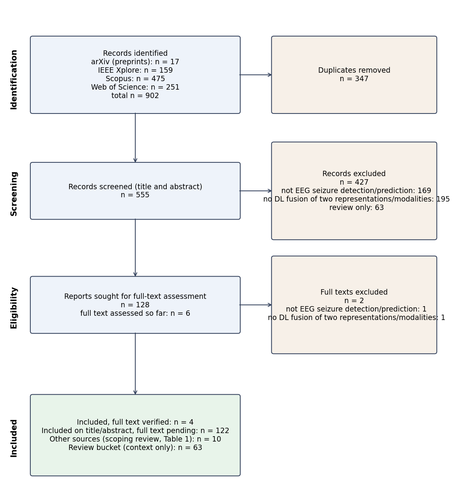

# Sistematik Literatür Taraması: Sonuçlar

**Tarih:** 3-4 Ekim 2026 (aramalar 3 Ekim 2026'da çalıştırıldı)
**Protokol:** `docs/14_SISTEMATIK_TARAMA_PROTOKOLU.md`
**Veri ve kod:** `paper/literature/` (`screen.py`, `records*.csv`, `extraction.csv`,
`prisma.png`, `references.bib`, `exports/`)
**Durum:** Aramalar, başlık/özet taraması ve ikinci göz kontrolü tamam. Tam metin
taraması kısmi: en yakın rakip adaylarından 6 makale tam metinden okundu, kalan 122
aday özet düzeyinde dahil edildi ve `extraction.csv`'de `full_text_read = no` olarak
işaretli (Bölüm 8).

---

## 1. Özet

- Dört veritabanında 902 kayıt bulundu; tekilleştirme sonrası 555 kayıt tarandı.
  Başlık/özet aşamasında 103 kayıt dahil, 25 kayıt belirsiz, 427 kayıt hariç.
- Bağımsız AI ikinci geçişi (rastgele %20, 111 kayıt) ile uyuşma %91.9,
  Cohen kappa 0.81.
- **En yakın çalışma artık Daşdemir 2025 değil, An ve ark. 2026 (fastSeizureNet).**
  EEG nöbet tespitinde beş füzyon operatörünü karşılaştırıyor; ancak parametre eşlemesi
  yok, operatörler arasında istatistiksel test yok, denklik testi yok.
- Boşluk iddiası dar haliyle ayakta: tam metni okunan çalışmalar arasında üç veya daha
  fazla füzyon operatörünü **eşlenmiş parametre bütçesi** altında **düzeltilmiş eşli
  test ve denklik testi** ile karşılaştıran bir EEG nöbet çalışması yok. "Operatörler
  hep tek tek öneriliyor" türü ifadeler ise artık doğru değil (fastSeizureNet,
  Einizade 2023, Basheer 2026 birden fazla operatörü karşılaştırıyor).

## 2. Arama kaydı

### 2.1 Kısım A (protokol §3)

| Veritabanı | Tarih | Sorgu (birebir) | Sonuç |
|---|---|---|---|
| Scopus | 2026-10-03 | `TITLE-ABS-KEY ( ( "EEG" OR "electroencephalogra*" ) AND ( "seizure" OR "epilep*" ) AND ( "fusion" OR "multimodal" OR "multi-modal" ) AND ( "deep learning" OR "CNN" OR "convolutional neural network" OR "neural network" ) ) AND ( LIMIT-TO ( LANGUAGE , "English" ) )` | 475 |
| Web of Science Core Collection | 2026-10-03 | `TS=(("EEG" OR "electroencephalogra*") AND ("seizure" OR "epilep*") AND ("fusion" OR "multimodal" OR "multi-modal") AND ("deep learning" OR "CNN" OR "convolutional neural network" OR "neural network"))`, arayüzde Languages = English | 252 → 251 (English) |
| IEEE Xplore (Command Search) | 2026-10-03 | `("All Metadata":"EEG" OR "All Metadata":"electroencephalogram") AND ("All Metadata":"seizure" OR "All Metadata":"epilepsy" OR "All Metadata":"epileptic") AND ("All Metadata":"fusion" OR "All Metadata":"multimodal" OR "All Metadata":"multi-modal") AND ("All Metadata":"deep learning" OR "All Metadata":"CNN" OR "All Metadata":"convolutional neural network")` | 159 |
| arXiv API (protokol dizesi) | 2026-10-03 | `abs:EEG AND abs:seizure AND (abs:fusion OR abs:multimodal) AND (abs:"deep learning" OR abs:CNN)` | 10 |
| arXiv API (Scopus dizesinin karşılığı) | 2026-10-03 | `(abs:EEG OR abs:electroencephalogra*) AND (abs:seizure OR abs:epilep*) AND (abs:fusion OR abs:multimodal OR abs:"multi-modal") AND (abs:"deep learning" OR abs:CNN OR abs:"convolutional neural network" OR abs:"neural network")` | 17 (protokol dizesinin 10 sonucunun hepsini içeriyor) |

**Protokolden sapmalar, gerekçeleriyle:**

1. **IEEE alanı.** Protokol "Full Text & Metadata" diyordu. Bu alan 2,748 sonuç verdi:
   dışa aktarma sınırını (2,000) aşıyor ve tam metinde geçen her "fusion" ya da
   "neural network" ifadesini yakalıyor. Scopus'taki `TITLE-ABS-KEY` ve WoS'taki `TS`
   ile eşdeğer olan "All Metadata" alanı kullanıldı (başlık, özet, indeks terimleri).
2. **arXiv dizesi.** Protokoldeki arXiv dizesi Scopus dizesinden dardı ("multi-modal",
   "neural network", "epilep*" yok). Scopus'un karşılığı olan geniş dize de
   çalıştırıldı; arXiv havuzu iki dizenin birleşimi (17 kayıt).
3. **IEEE dışa aktarımı.** "Results" dışa aktarımı kişisel IEEE hesabı istediği için
   kayıtlar "Citations" sekmesinden RIS + özet olarak, 100 + 59 kayıtlık iki dosya
   halinde alındı.
4. **Lisans.** Scopus, WoS ve IEEE dışa aktarımları yayıncı özetleri içerdiği için
   herkese açık repoya konmadı. Repoda yalnızca künye alanları var (`*_meta.csv`);
   özetli tam dosyalar yerel olarak tutuluyor (`exports/.gitignore`).

### 2.2 Kısım B (tamamlayıcı tarama)

| Konu | Scopus sorgusu (birebir) | Scopus | arXiv |
|---|---|---|---|
| B1 Ön işleme seçimleri, multiverse | `TITLE-ABS-KEY ( ( "EEG" OR "electroencephalogra*" OR "event-related potential*" OR "ERP" ) AND ( "multiverse" OR "many analysts" OR "analytic* flexibility" OR "forking paths" OR ( ( "preprocessing" OR "pre-processing" ) AND "pipeline*" AND ( "deep learning" OR "decoding" ) AND ( "impact" OR "effect" OR "compar*" ) ) ) ) AND ( LIMIT-TO ( LANGUAGE , "English" ) )` | 116 | 42 |
| B2 Seed değişkenliği, tekrarlanabilirlik | `TITLE-ABS-KEY ( ( "random seed*" OR "seed variance" OR "run-to-run" OR "nondetermin*" OR "non-determin*" OR "training variability" OR "training variance" ) AND ( "deep learning" OR "neural network*" ) AND ( "reproducib*" OR "variance" OR "variability" ) ) AND LANGUAGE ( english )` | 291 | 48 |
| B3 ICA algoritmaları, göz artefaktı | `TITLE-ABS-KEY ( ( "EEG" OR "electroencephalogra*" ) AND ( "independent component analysis" OR "ICA" ) AND ( "infomax" OR "AMICA" OR "FastICA" OR "Picard" OR "ICLabel" OR "GEDAI" OR "ocular artifact*" OR "ocular artefact*" OR "eye movement artifact*" ) AND ( "compar*" OR "automat*" OR "evaluat*" ) ) AND LANGUAGE ( english )` | 339 | 12 |
| B4 Nöbet tespitinde değerlendirme | `TITLE-ABS-KEY ( ( "EEG" OR "electroencephalogra*" ) AND "seizure*" AND ( "SzCORE" OR "event-based" OR "event based" OR "false alarm*" OR "evaluation framework" OR "evaluation metric*" OR "performance metric*" OR "evaluation methodolog*" ) AND ( "detection" OR "detector*" ) ) AND LANGUAGE ( english )` | 533 (dışa aktarılamadı) | 37 |

arXiv sorguları birebir `paper/literature/exports/arxiv_queries.json` dosyasında.
B4 için Scopus sonuç sayısı kayıtlı, ancak dışa aktarım tamamlanamadı; B4 seçimi
arXiv havuzundan yapıldı.

## 3. PRISMA

| Aşama | n |
|---|---|
| Belirlenen kayıt | Scopus 475, WoS 251, IEEE 159, arXiv 17; toplam 902 |
| Tekilleştirmede çıkarılan | 347 |
| Başlık/özet taranan | 555 |
| Başlık/özette hariç | 427 (konu dışı 169; derin öğrenmeyle iki temsil/modalite füzyonu yok 195; derleme 63) |
| Tam metin için seçilen | 128 (dahil 103 + belirsiz 25) |
| Tam metni değerlendirilen | 6 |
| Tam metinde hariç | 2 (A0102: aynı girdiden iki akış, gerekçe 2; A0254: modelde EEG girdisi yok, gerekçe 1) |
| Dahil, tam metinle doğrulanmış | 4 |
| Dahil, tam metin bekleyen | 122 |
| Diğer kaynaklar (`docs/09`, makale Tablo 1) | 10 |
| Derleme kovası (yalnızca bağlam) | 63 |

Sayılar `paper/literature/prisma_counts.json` dosyasından, `python
paper/literature/screen.py prisma` ile üretildi.

**Arama duyarlılığı.** Önceki kapsam taramasından bilinen iki ilgili EEG nöbet füzyon
çalışması (Das 2024, Huang 2024) aramalarda çıkmadı. Sorgu terimleri özetlerinde
geçmeyen çalışmaları kaçırabiliyor; bu bir sınırlılık olarak yazılmalı. İki çalışma
"diğer kaynaklar" olarak eklendi.

## 4. Tarama yöntemi ve ikinci göz

**Birincil tarama.** Görev tanımı kararların öğrenci tarafından verilmesini
öngörüyordu. Hasan'ın açık tercihiyle başlık/özet kararlarını Claude (AI) verdi:
§4 ölçütleri birebir uygulandı, her hariç kararı gerekçe numarası ve kısa notla
`records.csv`'de (`stage1`, `stage1_reason`, `stage1_note`). **Bu, görevdeki kuraldan bir
sapmadır ve makalede açıkça yazılmalıdır.**

Ölçüt 3'ün uygulanışı: Dahil olmak için derin bir ağın en az iki farklı **temsili**
(ham sinyal + spektrogram/wavelet görüntüsü, zaman + frekans dalları, el yapımı +
derin öznitelikler, iki farklı görüntü kodlaması) ya da iki **modaliteyi** (EEG + EKG,
EMG, video, MRI, fNIRS, klinik metin) birleştirmesi gerekti. Aynı temsilin çok ölçekli
ya da çok bantlı sürümleri, aynı girdi üzerinde uzamsal ve zamansal dallar, aynı girdi
üzerinde model topluluğu ve klasik makine öğrenmesi (derin ağ olmadan) dahil edilmedi.
Spike/IED/HFO tespiti, odak lokalizasyonu ve fokal/fokal olmayan sınıflandırma "nöbet
tespiti/tahmini" sayılmadı.

**İkinci göz (AI ikinci geçiş).** Rastgele %20'lik alt küme (111 kayıt, seed 20261003),
birincil kararları görmeyen ayrı bir Claude ajanı tarafından yalnızca başlık, özet ve
§4 ölçütleriyle tarandı. **Bu bir insan değerlendiricinin yerini tutmaz.**

| Ölçü | Değer |
|---|---|
| Kayıt | 111 |
| Uyuşma (dahil / hariç / belirsiz) | %91.9 |
| Cohen kappa | 0.81 |
| "Tam metne gider mi" (dahil + belirsiz vs hariç) uyuşması | %94.6 |

Anlaşmazlıklar (birincil → ikinci): A0102 belirsiz → hariç; A0147 hariç → belirsiz;
A0170 hariç → belirsiz; A0267 dahil → belirsiz; A0355 hariç → dahil; A0356 dahil →
belirsiz; A0386 dahil → belirsiz; A0431 hariç → dahil; A0524 hariç → dahil. Hepsi
ölçüt 3 sınırında (el yapımı öznitelik füzyonu, "multimodal" deyip modaliteyi
belirtmeyen özetler).

## 5. En yakın çalışmalar

Tam metinden okunanlar. Her iddianın kaynağı `extraction.csv`'nin `evidence`
sütununda bölüm ve tablo düzeyinde verildi; özet:

| Çalışma | Görev, veri | Karşılaştırılan operatörler | Parametre eşleme | İstatistik | CV | Kaynak (bölüm/tablo) |
|---|---|---|---|---|---|---|
| **An et al. 2026**, *Neural Networks* (fastSeizureNet) | Tespit; CHB-MIT, CHSZ | **5**: concat, sum, intra-feature attention, iki inter-feature attention | Yok (stratejilerin parametre sayısı verilmiyor) | Wilcoxon + Holm yalnızca yöntem vs önceki yöntemler; operatörler arasında yok | Hasta içi 5 kat; hastalar arası LOPO; 3 omurga | §3.4 ve Şekil 4 (operatörler); §4.5, Tablo 5-6 (operatör sonuçları); Tablo 7 (Wilcoxon+Holm) |
| **Einizade et al. 2023**, *BSPC* (fAttNet) | Tespit; TUH, 62 denek | **4**: majority vote, average, concatenation, attention | Belirtilmemiş | Yok (yalnızca ortalama ± SS; farklar 0.84-0.86, SS 0.03-0.07) | LOSO | §2.4.1 (üç görünüm); sonuç tablosu "baseline fusion strategies" satırları (tablo numarası kaydedilmedi); §3.1 (LOSO) |
| **Basheer & Mishra 2026**, *Pattern Recognition Letters* | Tespit; TUSZ, CHB-MIT | **3**: concatenation, element-wise addition, KAN gating | Belirtilmemiş | Eşli t-testi, 6 seed, düzeltmesiz | Sabit TUSZ bölmesi | Tablo 4 ("primary controlled comparison") ve tablo notu |
| **Daşdemir & Kahramanlı Örnek 2025**, *JESTCH* | Tahmin; CHB-MIT (18 hasta) | **2**: karar düzeyi (IT2 ağırlıklı ortalama), öznitelik düzeyi (IT2 kapı) | Yok (0.214 M vs 0.169 M) | Yok (97.70 vs 97.50 betimsel) | Hasta içi 5 kat (dosyalar üzerinden) | §2.5 ve Şekil 2-3; §3.2, Tablo 5; Tablo 8 (parametreler); §2.3 ve Tablo 1 (CV) |
| **Wang et al. 2026**, *Neurocomputing* | Tespit; CHB-MIT, Siena | **2**: cross-attention vs concatenation (ablasyon) | Yok (~2.195 M) | Yok | Hasta içi leave-one-seizure-out | Ablasyon bölümü, Tablo 7; karmaşıklık ifadesi; "Evaluation protocols" |

Basheer 2026 ölçüt 3'e uymadığı için (iki akış aynı ham EEG'den) PRISMA'da tam metinde
hariç, ama operatör karşılaştırması olarak ilgili.

Özet düzeyinde (tam metin bekleyen) operatör karşılaştırması içeren adaylar:
A0448 (öznitelik vs olasılık düzeyi füzyon, tek temsil), A0509 (ensemble vs Choquet
fuzzy integral), A0405 (cross-model attention vs öznitelik/karar füzyonu), A0252 (ham +
öznitelik birleştirme, sığ ANN vs 1D CNN), A0144 (üç görünümde inanç füzyonu), A0443
(ham, FT, STFT, wavelet girdilerinin öznitelik füzyonu).

## 6. Boşluk iddiası

**Hâlâ geçerli olan ifade:**

> Several studies now compare more than one fusion operator for EEG seizure detection
> (An et al. 2026 compare five; Einizade et al. 2023 four; Basheer and Mishra 2026
> three), but none of those we read in full matches parameter counts across operators
> or tests the operator differences with a resampling-corrected paired test, and none
> tests equivalence. In Einizade et al. the four operators lie within one standard
> deviation of each other, the pattern our corrected and equivalence tests are
> designed to resolve.

**Artık yazılamayacak ifade:**

> "Fusion operators for EEG seizure detection are proposed one at a time."

**Çekince:** 122 aday henüz tam metinden okunmadı. İddia "tam metni okunan
çalışmalar arasında" diye sınırlanmalı ya da tam metin taraması tamamlanmalı.

## 7. Kısım B: tamamlayıcı tarama özetleri

Her çalışma dışa aktarımdan geldi ve BibTeX'i Crossref ya da arXiv ile doğrulandı
(`references.bib`). Özetler yalnızca ilgili kaydın özetine dayanıyor.

### B1. Ön işleme seçimleri ve multiverse analizi

- **Clayson et al. 2021** (NeuroImage; `Clayson_2021`). ERN ve Pe için veri işleme
  kararlarının oluşturduğu multiverse'i inceleyip veri kalitesi ve psikometrik
  güvenilirliğe göre en iyi işlem hatlarını seçiyor. *Bizim için:* EEG'de "multiverse"
  çerçevesinin yerleşik referansı.
- **Clayson 2024** (Int J Psychophysiol; `Clayson_2024`). Psikofizyolojide multiverse
  analizinin derlemesi ve uygulama rehberi. *Bizim için:* P0-P6 tasarımının
  yöntemsel dayanağı.
- **Šoškić et al. 2024** (Psychophysiology; `Soskic_2024`). Literatürden seçilen 14
  N400 işlem hattını aynı veri setine uyguluyor; istatistiksel sonuç, etki büyüklüğü ve
  güç hatta göre değişiyor. *Bizim için:* ön işleme kararlarının sonucu değiştirdiğinin
  somut örneği.
- **Short et al. 2025** (J Neurosci Methods; `Short_2025`). Büyük EEG multiverse'lerinde
  tüm hatları hesaplamak yerine örnekleme yaklaşımlarını karşılaştırıyor. *Bizim için:*
  P0-P6 gibi sınırlı ve gerekçeli bir hat seçimini savunmak için.
- **Huang et al. 2025** (Psychophysiology; `Huang_2025`). N-back görevinde 43 ön işleme
  hattını (filtreler, ICA, referans) üç veri setinde karşılaştırıyor; tek bir en iyi
  hat yok. *Bizim için:* "no single best pipeline" bulgusunun EEG'deki karşılığı.
- **Kołodziej et al. 2021** (eLife; `Kolodziej_2021`). Beş çalışmada frontal alfa
  asimetrisi için multiverse analizi; etki, analiz seçimlerine karşı dayanıksız.
  *Bizim için:* multiverse'in bir bulguyu çürütebildiğinin örneği.
- **Del Pup et al. 2025** (IEEE TNSRE; `Del_Pup_2025`). EEG derin öğrenmede ön işleme
  düzeylerinin etkisini sistematik olarak inceliyor. *Bizim için:* en yakın ön
  işleme-derin öğrenme çalışması; zaten makalenin kaynakçasında.
- **Gao et al. 2025** (IEEE JBHI; `Gao_2025`). Motor imagery BCI'da ICA dahil ön işleme
  yöntemlerinin ve sırasının etkisi. *Bizim için:* ön işleme sırasının da bir karar
  olduğunu gösteriyor.
- **Truong et al. 2025** (IEEE NER; `Truong_2025`). EEG derin öğrenmede normalizasyon
  düzeyini (kayıt vs pencere, kanallar arası vs kanal içi) karşılaştırıyor. *Bizim
  için:* P5'teki normalizasyon seçiminin literatürdeki karşılığı.

### B2. Eğitim rastlantısallığı ve tekrarlanabilirlik

- **Summers & Dinneen 2021** (ICML/PMLR, arXiv; `Summers2021arxiv`). Optimizasyondaki
  belirsizlik kaynaklarını ayırıyor; tüm kaynakların model çeşitliliğine benzer etki
  yaptığını gösteriyor. *Bizim için:* küçük farkların koşudan koşuya değişkenlikten
  ayırt edilemeyeceği argümanı.
- **Pham et al. 2020** (ASE; `Pham_2020`). Aynı ayarlarla eğitimlerin farklı doğruluk
  verdiğini ve kütüphane düzeyindeki (paralellik, kayan nokta) varyansı ölçüyor.
  *Bizim için:* uygulama düzeyi varyansın bilinen bir sorun olduğu.
- **Xiao et al. 2021** (ISSRE; `Xiao_2021`). **CPU çoklu iş parçacığının** derin öğrenme
  eğitimindeki belirsizliğe etkisini inceliyor. *Bizim için:* thread sayısı bulgumuzun
  doğrudan literatür karşılığı; makaleye mutlaka girmeli.
- **Shanmugavelu et al. 2024** (SC Workshops; `Shanmugavelu_2024`). Kayan nokta
  işlemlerinin birleşmeli olmamasının HPC ve derin öğrenmede tekrarlanabilirliğe
  etkisi. *Bizim için:* thread bulgusunun mekanizması.
- **Chen et al. 2022** (ICSE; `Chen_2022`). Yazılım ve donanım kaynaklı rastlantısallığı
  denetleyerek tekrarlanabilir eğitim için sistematik bir yaklaşım. *Bizim için:*
  sabit thread ve seed politikamızın dayanağı.
- **Banerjee et al. 2025** (IEEE JSTSP; `Banerjee_2025`). Seed kaynaklı eğitim
  değişkenliğini ölçmek için sağlam bir hipotez testi çerçevesi. *Bizim için:* seed
  tekrarlarının istatistiksel olarak ele alınması.
- **van den Berg et al. 2017** (ICASSP; `van_den_Berg_2017`). Konuşma tanımada eğitim
  varyansının sonuç raporlamasını değiştirecek kadar büyük olduğunu gösteriyor.
  *Bizim için:* tek koşu raporlamasının eleştirisi.
- **Picard 2021** (arXiv; `Picard2021arxiv`). 10^4 seed tarayarak uç değer seed
  bulmanın kolay olduğunu gösteriyor. *Bizim için:* seed seçiminin sonuç
  "seçtirebileceği" uyarısı.

### B3. ICA algoritmaları ve otomatik bileşen seçimi

- **Pion-Tonachini et al. 2019** (NeuroImage; `Pion_Tonachini_2019`). ICLabel: bağımsız
  bileşenleri otomatik sınıflandıran yaygın araç. *Bizim için:* P6'da EOG kanalı
  olmadan göz bileşeni seçimi için referans.
- **Kang et al. 2024** (J Neural Eng; `Kang_2024`). Infomax ve AMICA ile üç bileşen
  reddetme stratejisini (yok, ICLabel, MARA) üç BCI veri setinde deneyip ICA tabanlı
  temizlemenin derin ağ performansını artırmadığını buluyor. *Bizim için:* P6'nın
  beklenen etkisi üzerine en doğrudan kanıt.
- **Albera et al. 2012** (Bull Pol Acad Sci; `Albera_2012`). On beş ICA yöntemini EEG
  kas artefaktı temizlemede karşılaştırıyor. *Bizim için:* algoritma seçiminin (P6a-c)
  sonucu değiştirebileceği.
- **Frølich & Dowding 2018** (Brain Informatics; `Frolich_2018`). Extended Infomax,
  FastICA, TDSEP ve iki başka ayrıştırmayı kas artefaktı için karşılaştırıyor.
  *Bizim için:* Infomax ile diğer yöntemlerin karşılaştırma örneği.
- **Dimigen 2020** (NeuroImage; `Dimigen_2020`). Serbest bakış deneylerinde ICA ile göz
  artefaktı temizleme parametrelerini optimize ediyor. *Bizim için:* ICA öncesi
  filtrelemenin ve eğitim verisinin etkisi.
- **Mennes et al. 2010** (Psychophysiology; `Mennes_2010`). Göz hareketi artefaktında
  ICA'nın farklı veri kesitleriyle uygulanmasını doğruluyor. *Bizim için:* ICA'nın
  hangi veri üzerinde eğitildiğinin önemi.
- **Frank et al. 2023, 2025** (IEEE BIBE, IEEE NER; `Frank_2023`, `Frank_2025`). AMICA
  parametrelerini ve veri miktarını inceliyor; AMICA'yı referans algoritma olarak
  konumluyor. *Bizim için:* P6c (AMICA) ayarlarının gerekçesi.

**Eksik:** GEDAI dışa aktarımlarda (Scopus B3, arXiv B3) bulunmadı. Kural gereği
hafızadan eklenmedi; bir sonraki adımda bioRxiv'den doğrulanarak eklenmeli.

### B4. Nöbet tespitinde standart değerlendirme

- **Dan et al. 2024** (Epilepsia; `Dan_2024`). SzCORE: veri setleri, değerlendirme
  yöntemi ve metrikler (olay bazlı duyarlılık, saatte yanlış alarm) için ortak
  çerçeve. *Bizim için:* CHB-MIT ve Siena değerlendirmesinin standart referansı.
- **Dan et al. 2025** (arXiv; `Dan2025arxiv`). SzCORE yarışmasında 28 mimarinin
  görülmemiş hastalara genelleme açığını ölçüyor. *Bizim için:* hasta bazlı
  değerlendirmenin neden zorunlu olduğu.
- **Ziyabari et al. 2017** (arXiv; `Ziyabari2017arxiv`). EEG olay sınıflandırmasında
  skaler metriklerin yanıltıcı olabildiğini, olay bazlı metrikleri ve 24 saatte yanlış
  alarmı öneriyor. *Bizim için:* olay düzeyi metrik eklenmesi.
- **Lee et al. 2022** (arXiv; `Lee2022arxiv`). Gerçek zamanlı nöbet tespitinde güncel
  modelleri ortak ve gerçekçi bir ortamda karşılaştırıyor. *Bizim için:* kontrollü
  karşılaştırma tasarımının bir örneği.
- **Yang et al. 2021** (arXiv; `Yang2021arxiv`). Bir nöbet tanıma sisteminin
  kıtalar arası genellemesi. *Bizim için:* dış doğrulama (Siena) gerekçesi.
- **Moutonnet et al. 2024** (arXiv; `Moutonnet2024arxiv`). Kafa derisi EEG'de nöbet
  tespiti algoritmalarının klinik çeviri koşullarına sistematik derleme. *Bizim için:*
  raporlama standartları.

## 8. Makalenin Tablo 1'i için önerilen sürüm

Temel, main'deki Tablo 1 (commit 285a913, fastSeizureNet satırı dahil). Sütunlar aynı.
Değişiklikler: dört yeni satır (Work sütununda "*(new)*" ile işaretli, yayına girerken
işaret kaldırılmalı) ve fastSeizureNet satırında bir düzeltme. fastSeizureNet'te
Wilcoxon + Holm testi **var**, ama yalnızca önerilen yöntem ile önceki yöntemler
arasında (Tablo 7). Bu yüzden "not compared with a statistical test" yerine "not
compared with each other by a statistical test" yazılmalı. Diğer satırlar main'deki
haliyle aynı.

| Work | Contribution | What it leaves open |
|---|---|---|
| Andrzejak et al. (2001) | Introduces the Bonn EEG corpus | No per segment subject identifiers |
| Acharya et al. (2018) | Early deep CNN for Bonn seizure detection | Single architecture, no operator comparison |
| Truong et al. (2018) | CNN over spectrograms, scalp and intracranial | No raw signal branch to fuse against |
| Wang et al. (2020) | Compares 1D and 2D CNNs | Compared separately, not fused |
| Chatzichristos et al. (2020) | Attention gated multi view fusion | One operator, no alternatives compared |
| Das et al. (2024) | 1D+2D fusion of decomposed EEG | Fixed design, no operator ablation |
| Huang et al. (2024) | Multi head attention fusion | Reports gains without matching parameter count |
| Golrizkhatami and Acan (2018) | Three level fusion for ECG | Different signal domain, related fusion methodology |
| Narotamo et al. (2024) | Compares 1D and 2D representations plus early, late, and joint fusion, the same design question as ours | ECG, not EEG; no parameter matching or corrected/equivalence statistics |
| Roy (2019), Shoeibi (2021), Xu (2024) | Reviews of deep learning for EEG | Document inconsistent evaluation protocols, do not resolve them |
| Ali et al. (2024) | Shows CHB-MIT results depend heavily on evaluation choices | Concerns evaluation of CHB-MIT generally, not fusion operators |
| Dan et al. (2024), SzCORE *(new)* | Standard datasets, event-based scoring and metrics for EEG seizure detection | An evaluation framework, not a fusion operator comparison |
| Rheude et al. (2025) | Multimodal complexity often does not pay off | General multimodal setting, not EEG |
| **Daşdemir (2025)** | **Self described fair, protocol controlled comparison of two fusion strategies for EEG** | Seizure *prediction*, not detection; two operators; reports a 0.20 point accuracy difference (97.50 vs 97.70) without a stated statistical test or parameter matching |
| **An et al. (2026), fastSeizureNet** | **Compares five fusion strategies for EEG seizure detection**, within and across patients, with several backbones (semi-supervised) | Fuses hand-crafted feature knowledge with deep features rather than a raw waveform with its spectrogram; the strategies are not parameter matched and are not compared with each other by a statistical test (Wilcoxon with Holm correction is used only against prior methods) |
| Einizade et al. (2023), fAttNet *(new)* | Compares four fusion operators (majority vote, averaging, concatenation, attention) over raw EEG, wavelet packet and hand-engineered views, leave-one-subject-out on TUH | No parameter matching and no statistical test; the operators lie within one standard deviation of each other |
| Basheer and Mishra (2026) *(new)* | Compares concatenation, element-wise addition and KAN gating for seizure detection, with paired t-tests over six seeds | Both streams come from the same raw EEG rather than two representations; uncorrected tests against concatenation only; no parameter matching |
| Wang et al. (2026), *Neurocomputing* *(new)* | Cross-attention fusion of time-domain and S-transform views, CHB-MIT and Siena | One ablation against concatenation, patient-specific evaluation, no statistical test |
| Camastra et al. (2026), *Brain Sciences* | Controlled fusion benchmark, concludes strategy matters more than architecture | Tabular neuroimaging features, not EEG time series; no paired or equivalence testing |
| Mohamady et al. (2026) | Seven fusion techniques compared on one benchmark | Human activity recognition, not EEG; states this kind of head to head comparison did not previously exist in that field either |
| Kontras et al. (2026), NeuroAtlas | Reports Bonn is saturated (11 models at AUROC ≥ 0.99) and carries no subject identifiers | Foundation model benchmark, not a fusion operator comparison |

Tablonun altındaki paragraf için öneri: main'deki "fusion operators for EEG seizure
detection are proposed frequently but are usually proposed and evaluated one at a
time" cümlesi, Einizade 2023 ve Basheer 2026 da birden fazla operatörü karşılaştırdığı
için "several studies now compare two to five operators (Einizade et al. 2023; An et
al. 2026; Basheer and Mishra 2026), but none we read in full matches parameter counts
or tests the operators against each other with corrected or equivalence tests" gibi
yumuşatılabilir. Ayrıca "subject to revision once the registered search (`docs/14`)"
ifadesi, arama artık çalıştırıldığı için bu belgeye (`docs/15`) atıf yapacak şekilde
güncellenebilir. Makale metnini Atay günceller.

## 9. Açık işler (durum: 10 Ekim 2026)

1. **Tam metin taraması.** 122 aday var (`extraction.csv`, `stage2 = pending`).
   Bölüm 9'daki öncelikli altı kayıttan açık erişimli ikisi tam metinden okundu ve
   bilgileri çıkarıldı:
   - **A0405, Kumbam ve Viji Amutha Mary 2023.** Çapraz-modal dikkat ile toplama
     tabanlı öznitelik füzyonunu karşılaştırıyor (Tablo 5). Bonn kullanıyor; bölme
     tanımı, test ve parametre bilgisi yok.
   - **A0443, Pan ve ark. 2022.** Tek operatör (dört dalın birleştirilmesi), yalnızca
     tek girdili modellere karşı; Bonn, 5/10/20 kat.

   Kalan dördü kapalı erişimli: A0448, A0509, A0252 (IEEE Xplore) ve A0144
   (Elsevier). Üniversite erişimi gerekiyor.

   `extraction.csv`'ye `extracted_by` sütunu eklendi. Tam metni okunan 8 satır
   "AI-assisted, pending human verification" olarak işaretli; insan kontrolünden
   sonra "AI-assisted, human-verified" yapılacak.
2. **Başlık/özet elemesi.** 111 kayıtlık örneklem için bağımsız bir üçüncü karar
   seti çıkarıldı: önceki AI kararlarına bakılmadan, yalnızca başlık ve özetten.
   - Sonuç: dahil 22, hariç 79, belirsiz 10.
   - Birincil AI elemesiyle uyuşma %90.1, Cohen kappa 0.765 (tam metne gider mi:
     %92.8, kappa 0.818). AI ikinci geçişiyle uyuşma %92.8, kappa 0.838.
   - Bu kararlar insan kararı değil, Hasan'ın gözden geçirmesini bekliyor. Danışmanın
     istediği kör insan elemesi henüz yapılmadı.
3. **B4 Scopus dışa aktarımı** (533 kayıt) yapılmadı; Scopus'a üniversite girişi
   gerekiyor.
4. **GEDAI kaynağı bulundu ve doğrulandı:** Ros ve ark. (2025), "Return of the
   GEDAI: Unsupervised EEG Denoising based on Leadfield Filtering", bioRxiv,
   doi:10.1101/2025.10.04.680449. Crossref ile doğrulandı (`references.bib`:
   `Ros_2025`) ve makalenin kaynakçasında var.
5. **Arama duyarlılığı.** Das 2024 ve Huang 2024 aramalarda çıkmamıştı. "Feature
   fusion" ve "1D and 2D" terimleriyle tekrar arama yapılmadı; Scopus erişimi
   gerekiyor.

## 10. Giriş için kaynaklar (danışmanın istediği dört konu)

Yalnızca daha önce dışa aktarımlardan gelen ve Crossref ya da arXiv ile doğrulanan
kaynaklar listelendi (`references.bib` anahtarları). Her satırdaki not, kaynağın
özetine ya da tam metnine dayanıyor.

**1. Ön işlemenin performansa etkisi**
- `Del_Pup_2025`: EEG derin öğrenmede ön işleme düzeylerinin etkisinin sistematik
  incelemesi.
- `Huang_2025`: 43 ön işleme hattı (filtre, ICA, referans), üç veri seti; tek bir en
  iyi hat yok.
- `Soskic_2024`: 14 N400 işlem hattı; istatistiksel sonuç hatta göre değişiyor.
- `Clayson_2021`, `Clayson_2024`, `Steegen_2016`: ERP'de ve genel olarak multiverse
  analizi.
- `Kolodziej_2021`: multiverse ile bir bulgunun dayanıksız çıkması.
- `Gao_2025`: MI-BCI'da ön işleme yöntemleri ve sırası.
- `Truong_2025`: EEG derin öğrenmede normalizasyon düzeyi.
- `Kang_2024`: ICA tabanlı temizlik (Infomax/AMICA, ICLabel/MARA) derin ağ
  performansını artırmıyor.

**2. Füzyon karşılaştırmaları ve sınırlılıkları**
- `An_2026` (5 operatör), `Einizade_2023` (4 operatör), `Basheer_2026` (3 operatör,
  aynı girdiden iki akış), `Dasdemir_2025` (2 strateji, tahmin), `Wang_2026a`
  (çapraz-dikkat ve birleştirme ablasyonu).
- Yeni okunan A0405 (2 operatör, zayıf kanıt) ve `Pan_2022` (A0443, tek operatör).
- Başka alanlarda: `Narotamo_2024` (EKG'de 1D/2D ve erken/geç/ortak füzyon),
  `Camastra_2026` (tablo verisi), `Mohamady_2026` (aktivite tanıma), `Rheude_2025`
  (çok modaliteli karmaşıklık).
- Derleme: `Lee_2025`, hibrit EEG arayüzlerinde füzyon stratejisi optimizasyonunu
  açık bir konu olarak gösteriyor.
- Ortak sınırlılık: parametre eşleme yok; operatörler arası düzeltilmiş ya da
  denklik testi yok.

**3. Tek seed ya da tek pipeline'a dayalı karşılaştırmaların güvenilirliği**
- `Summers2021arxiv`: bütün belirsizlik kaynakları benzer çeşitlilik üretiyor.
- `Picard2021arxiv`: uç seed'ler kolay bulunuyor.
- `Pham_2020`, `Xiao_2021`, `Shanmugavelu_2024`, `Chen_2022`: uygulama düzeyinde
  varyans, CPU çoklu iş parçacığı, kayan nokta.
- `van_den_Berg_2017`: eğitim varyansı.
- `Banerjee_2025`: seed değişkenliği için test.
- `Bouckaert_2004`, `Nadeau_2003`, `Jafrasteh_2025`: tekrarlı çapraz doğrulamada
  düzeltilmiş test ve değişkenlik.
- `Huang_2025`: pipeline seçimiyle değişen sonuçlar.

**4. Veri setleri arası genelleme**
- `Dan2025arxiv`: SzCORE yarışması, 28 mimaride görülmemiş hastalara genelleme
  açığı.
- `Dan_2024`: SzCORE değerlendirme çerçevesi.
- `Yang2021arxiv`: kıtalar arası genelleme.
- `Lee2022arxiv`: gerçekçi ortamda karşılaştırma.
- `Moutonnet2024arxiv`: klinik çeviri koşulları.
- Makalede de geçenler: `Ali_2024` (CHB-MIT sonuçlarının değerlendirme seçimlerine
  bağlılığı), `Kontras_2026` (NeuroAtlas).
- Eksik: hakemli, doğrudan EEG nöbet tespitinde veri setleri arası genelleme çalışması
  az; bunun için hedefli bir Scopus araması gerekiyor (erişim gerekiyor).
