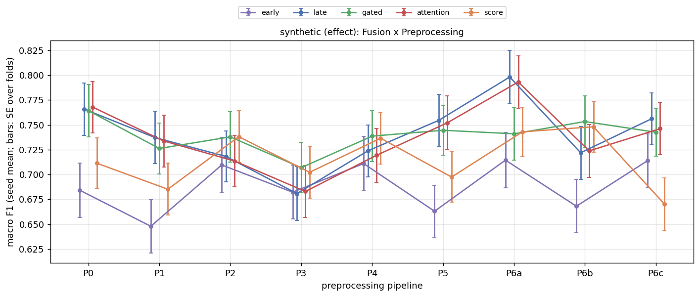
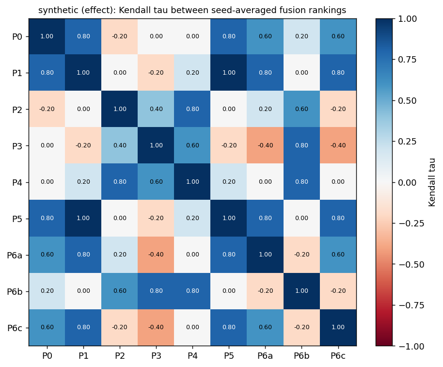
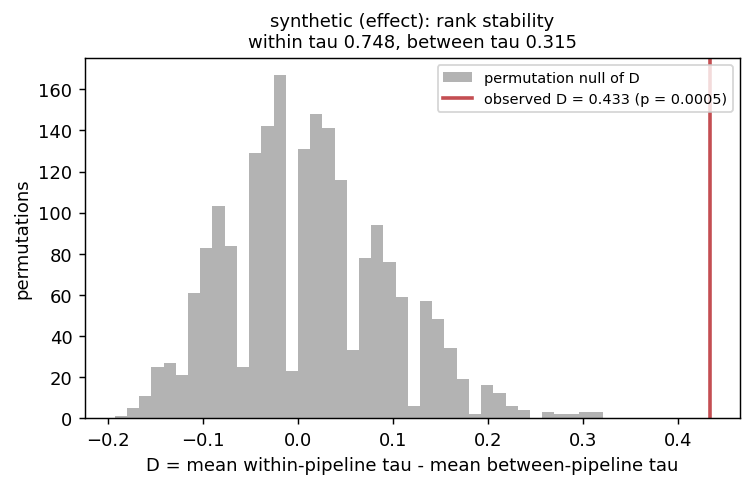
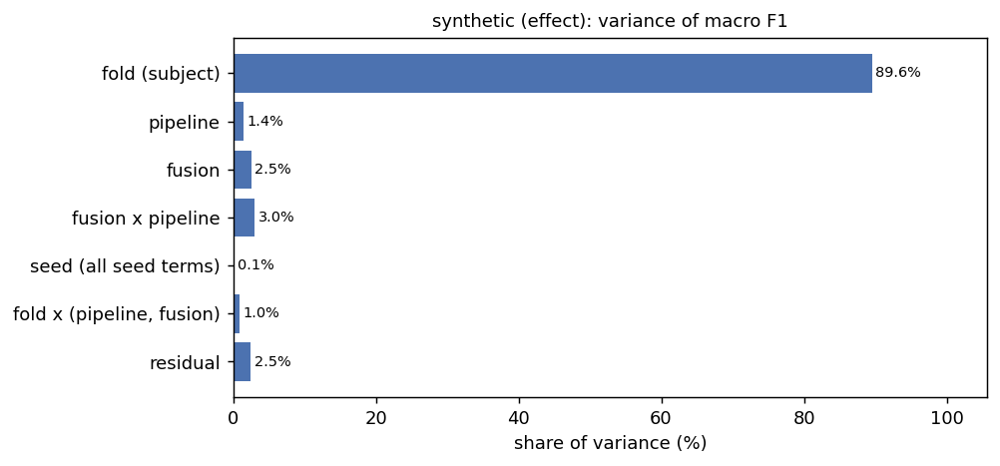
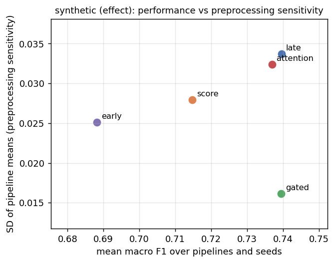
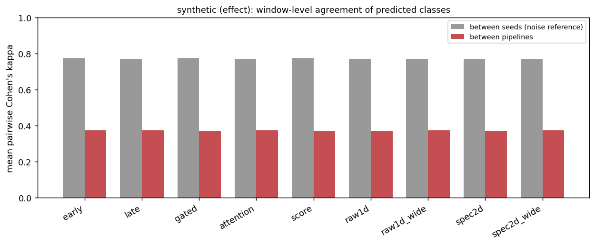
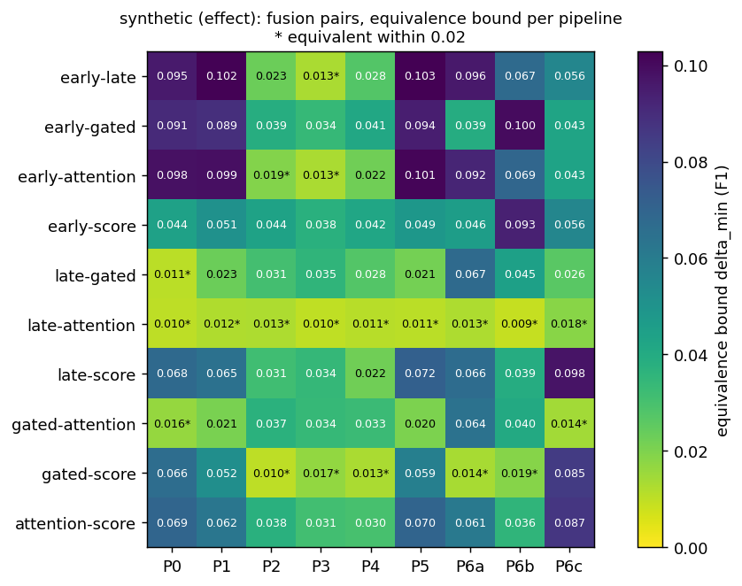

# Multiverse analysis

The project's question, as set by the advisor: **how robust are the results between
fusion operators to preprocessing and to stochastic training decisions?** The main
output is therefore the stability of the fusion ranking, next to mean performance.
`src/multiverse.py` reads every pipeline x seed run of one dataset and produces all
analyses and figures in one command.

```bash
python -m src.multiverse --dataset chbmit            # all analyses, CSV + PNG + summary.md
python -m src.multiverse --synthetic                 # validation on synthetic runs
```

Options: `--pipelines P0 P1 ...` and `--seeds 0 1 2` restrict the runs, `--margin`
sets the equivalence margin (default 0.02 macro F1), `--perms` the number of
permutations (default 10000), `--out` the output folder (default
`results_v2/multiverse/<dataset>/`).

## 1. Input

Runs are found by folder name under `results_v2/<dataset>/`, following
`src/chbmit_run.py: run_tag` and `src/run_queue.py: tag_for`:

| Folder | Pipeline | Seed |
|---|---|---|
| `loso_grouped` | P0 | 0 |
| `loso_P1`, `loso_P6a`, ... | P1, P6a, ... | 0 |
| `loso_P1_r1`, `loso_P1_r2`, ... | P1 | 1, 2, ... |

Other folders (`loso_main`, `*_cuda`, timing runs) are ignored. Each run contributes
`perfold.csv` (one row per fold and model) and `preds/fold<k>.npz` (`idx_te`, `y_te`
and the test probabilities of every deep model).

**Missing runs.** Results arrive piece by piece, so every analysis uses the largest
fully crossed block that exists: the seed set (among all subsets of available seeds)
that maximises pipelines x seeds, with every included pipeline having all of those
seeds and all five fusion models on the common folds. The block used is printed and
written to `summary.md`. With a single run (today: `loso_grouped`) the performance
table, the ranking and the per-pipeline equivalence are produced, and the analyses
that need two pipelines or two seeds say so instead of failing.

## 2. Analyses

Ranking analyses use the five fusion operators (early, late, gated, attention, score).
The other models (raw1d, spec2d, raw1d_wide, spec2d_wide, logvar, shallow) appear in the
performance table, and the deep ones in the prediction stability.

| # | Analysis | Method | Outputs |
|---|---|---|---|
| 1 | Performance | Fold means of macro F1, AUROC, AUPRC, sensitivity, specificity, Brier, log loss per pipeline, seed and model; seed mean and SD per pipeline and model. AUPRC is not in `perfold.csv`: `average_precision_score` per fold from the stored probabilities, then averaged (logvar and shallow store no probabilities) | `performance.csv`, `performance_by_pipeline.csv` |
| 2 | Rank stability (main) | Ranking of the fusion operators per run by fold-mean F1 (1 = best). Within a pipeline: Kendall's W and pairwise Kendall tau between seeds. Between pipelines: tau between seed-averaged rankings (heatmap). Same scale: mean tau over pairs of runs of the same pipeline versus pairs of different pipelines, D = within - between, with a permutation test. Repeated for P6a/P6b/P6c (ICA algorithm) | `rank_per_run.csv`, `rank_within_pipeline.csv`, `rank_tau_between_pipelines.csv`, `rank_stability_heatmap.png`, `rank_stability_permutation.png` |
| 3 | Fusion x Preprocessing | Interaction plot (seed means, error bars = SE over folds). Repeated-measures ANOVA with folds as subjects, pipeline and fusion as within factors, each effect against its interaction with fold, Greenhouse-Geisser corrected; sums of squares with numpy (no statsmodels) | `interaction.png`, `anova.csv` |
| 4 | Variance components | Method of moments on the fully crossed fold x pipeline x fusion x seed design (generalizability theory: all facets random) | `variance_components.csv`, `variance_components_grouped.csv`, `variance_components.png` |
| 5 | Equivalence, robust equivalence | Per pipeline and fusion pair: `src/stats.py: corrected_ttest` (Holm over the 10 pairs of a pipeline) and `corrected_equivalence_bound`, test/train ratio 1/(k-1) = 1/22 (`src/chbmit_stats.py: ratios`). Equivalent = bound <= margin. Robust equivalence = equivalent in every pipeline | `equivalence.csv`, `equivalence_robust.csv`, `equivalence.png` |
| 6 | Robustness and performance | Per fusion model: mean F1, SD and CV of the pipeline means, robustness = 1 - SD | `robustness_performance.csv`, `robustness_performance.png` |
| 7 | Prediction stability | Predicted class (p > 0.5) per window, windows matched by `idx_te`. Pairwise agreement and Cohen's kappa between pipelines (same seed) and between seeds (same pipeline, the noise reference); share of windows on which all runs of a group agree | `prediction_stability.csv`, `prediction_stability_pairs.csv`, `prediction_kappa_pipelines_<model>.csv`, `prediction_stability.png` |

### Design choices worth checking

- **The permutation test permutes pipeline labels within each seed**, not seed labels
  within each pipeline (as first proposed). Shuffling seed labels inside a pipeline
  leaves every run in its pipeline, so the between-pipeline tau would not change and no
  null distribution would arise. Permuting pipeline labels among the runs that share a
  seed keeps the seed structure (and any pairing by seed) and breaks only the pipeline
  structure, which is exactly H0: "the pipeline does not change the ranking beyond seed
  noise". p = (1 + #{D_perm >= D_obs}) / (1 + permutations), one-sided.
- **Within and between taus come from single-run rankings.** Seed-averaged rankings are
  less noisy than single runs; comparing them with between-seed taus would favour
  stability. The heatmap uses seed-averaged rankings because it describes pipelines.
- **The ANOVA averages seeds first.** With folds random and pipeline and fusion fixed,
  each effect's error term is its interaction with fold. Seed noise enters both mean
  squares alike, so the F tests stay valid; treating seed as a further random factor
  would need quasi-F ratios. The seed variance is measured in the variance components.
- **Variance components treat every factor as random.** For pipeline and fusion this
  is the variance of their effects (generalizability theory), which is what a share of
  variance means here. With one observation per cell the four-way interaction is the
  residual; it absorbs seed noise that is specific to a fold, pipeline and model.
  Negative estimates are reported in the CSV and set to zero for the shares.
- **Holm** runs over the 10 fusion pairs of each pipeline. `src/chbmit_stats.py` corrects
  over all 55 model pairs; the equivalence bounds are identical (checked on
  `loso_grouped`).
- **Equivalence uses seed means per fold**, so each pipeline gets one corrected test.

## 3. Validation

### Real data (smoke test)

`python -m src.multiverse --dataset chbmit` reads `loso_grouped` as the only run (P0,
seed 0, 23 folds). The fold means of F1, AUROC and log loss match
`results_v2/chbmit/loso_grouped/perfold.csv`, and the ten fusion-pair equivalence bounds
match `results_v2/chbmit/phase0_loso_grouped/chbmit_f1_macro.csv` to three decimals
(0.049 to 0.079). Ranking of the single run: attention, score, early, gated, late.

### Synthetic runs

`python -m src.multiverse --synthetic` writes runs with the structure of `loso_grouped`
(23 folds, 9 pipelines, 3 seeds, 11 models, `perfold.csv` and `preds/`) to a temporary
folder, twice, and runs every analysis on them unchanged:

- **effect**: a Fusion x Preprocessing interaction that reverses part of the ranking in
  P2-P4 and changes it differently in each of P6a, P6b and P6c; pipeline-specific
  window-level prediction changes (SD 1.0 on the logit, seed noise SD 0.4); late and
  attention identical in every pipeline (a truly equivalent pair)
- **null**: the same without interaction and without pipeline-specific prediction
  changes

Fold SD 0.12 (as between CHB-MIT subjects), pipeline SD 0.02, fold x model SD 0.015,
seed noise SD 0.02 per fold, pipeline, model and seed. The report goes to
`results_v2/multiverse/synthetic/validation.md`. Result: **30/30 checks passed.**

| Check | Result |
|---|---|
| effect: interaction detected | F = 94.0, p_GG = 8e-96 |
| null: no false interaction | F = 1.35, p_GG = 0.187 |
| effect: rankings differ more between pipelines than between seeds | tau within 0.748, between 0.315, p_perm = 0.0005 |
| null: no pipeline effect on rankings | tau within 0.852, between 0.870, p_perm = 0.843 |
| effect: ICA algorithm changes the ranking (P6a-c only) | D = 0.622, p_perm = 0.027 |
| null: no ICA-algorithm effect | D = -0.030, p_perm = 1.000 |
| effect: predictions change more between pipelines than seeds | kappa 0.373 vs 0.773 |
| null: pipeline and seed agreement alike | kappa 0.729 vs 0.729 |
| effect: the identical pair is robustly equivalent | late-attention, the only robust pair |
| effect: a pair with interaction is not robustly equivalent | early-late not robust |
| variance components, injected vs estimated (12 effects, both scenarios) | e.g. fold 0.01544 vs 0.01554, fusion x pipeline 0.00051 vs 0.00052, residual 0.00043 vs 0.00043 |
| seed terms that were not injected (8) | all within 1 % of the total variance of 0 |

The perfold metrics and the predictions are generated independently, each for its own
analyses, so the synthetic F1 values are not those the synthetic predictions would
give.

### Example figures (synthetic, effect scenario)









## 4. Open points

- **Equivalence margin.** 0.02 macro F1 is the wider ROPE of `src/chbmit_stats.py`. On
  CHB-MIT the single-run bounds are 0.049 to 0.079, so no pair will be equivalent at
  0.02 unless seed averaging narrows them a lot; every bound is reported, so another
  margin can be applied without rerunning.
- **Statistical power of the ICA comparison.** P6a/P6b/P6c give 3 pipelines x 3 seeds.
  Permuting within seeds gives 6^3 = 216 relabellings, but renaming the three pipelines
  leaves D unchanged, so there are only 36 distinct ones and the smallest attainable p
  is 1/36 = 0.028 (the synthetic effect scenario reaches it: p = 0.027). The test can
  only flag a ranking change that is consistent across all three seeds; the taus are
  the more informative output here.
- **Ties in rankings.** Five operators within a few hundredths of F1 can tie; ties get
  average ranks and tau-b handles them.
- **Siena.** `--dataset siena` works once Siena runs exist under `results_v2/siena/`
  with the same names.
