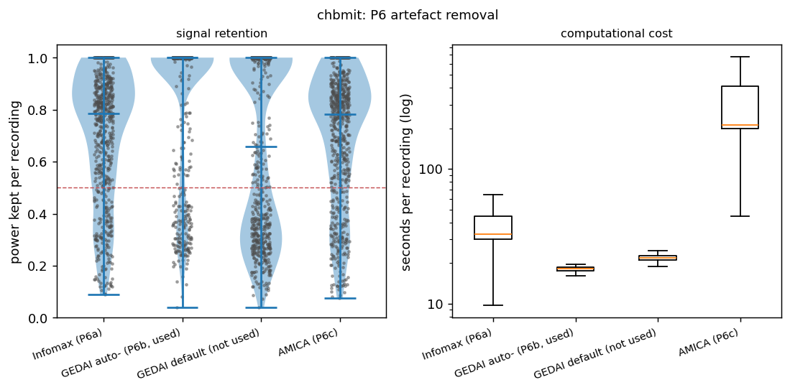
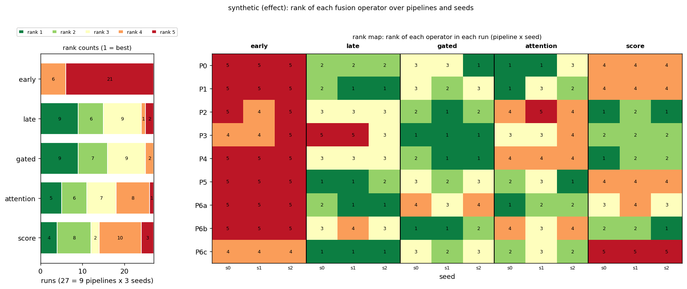

# Multiverse analysis

The project's question, as set by the advisor: **how robust are the results between
fusion operators to preprocessing and to stochastic training decisions?** The main
output is therefore the stability of the fusion ranking, next to mean performance.
`src/multiverse.py` reads every pipeline x seed run of one dataset and produces all
analyses and figures in one command.

```bash
python -m src.multiverse --dataset chbmit                  # all analyses, CSV + PNG + summary.md
python -m src.multiverse --dataset chbmit --first-report   # the advisor's first three items
python -m src.multiverse --synthetic                       # validation on synthetic runs
```

Options: `--pipelines P0 P1 ...` and `--seeds 0 1 2` restrict the runs, `--margin`
sets the main equivalence margin (fixed at 0.05 macro F1, strict analysis at 0.02),
`--perms` the number of permutations (default 10000), `--device cuda` reads the GPU
runs, `--no-corpus` skips loading the P0 corpus (P4's per-person table), `--out` the
output folder (default `results_v2/multiverse/<dataset>/`).

**The question (advisor, 4 October 2026):** does an observed advantage of a fusion
operator survive changes of preprocessing, of the ICA method and of stochastic
training? Preprocessing effect, seed effect and the Fusion x Preprocessing interaction
are reported separately (the "Effects, separately" section at the top of
`summary.md`). Primary metrics are window-level macro F1 and AUPRC; event-based
metrics are secondary (docs/EVENTS.md).

## 1. Input

Runs are found by folder name under `results_v2/<dataset>/`, following
`src/chbmit_run.py: run_tag` and `src/run_queue.py: tag_for`:

| Folder | Pipeline | Seed |
|---|---|---|
| `loso_grouped` | P0 | 0 |
| `loso_P1`, `loso_P6a`, ... | P1, P6a, ... | 0 |
| `loso_P1_r1`, `loso_P1_r2`, ... | P1 | 1, 2, ... |

Other folders (`loso_main`, timing runs) are ignored.

Two further inputs, used only by the P4 and P6 sections:

- **P4 rejection**: the `rejection` field of each P4 run's `meta.json`
  (`ictal_rejected`, `ictal_total`, `nonictal_rejected`, `nonictal_total`), and for
  the per-person table the unfiltered P0 corpus (`build_corpus` from its cache or the
  EDF files), on which `src/preprocess.py: artifact_mask` is recomputed. The rule
  works on the signal, not on the model, so the per-person totals must equal the
  `meta.json` totals; a mismatch is reported. Without the corpus the table is skipped
  with a note.
- **P6 logs**: `data/ica_logs/<signal tag>/<record>.json` (power kept, seconds,
  components removed), written when the P6 caches are built. If that folder is not
  on the machine, the collected copy in the repository is used
  (`results_v2/qc/p6_recording_logs.csv`, CHB-MIT, 670 recordings x 4 variants: P6a,
  P6b, P6c and GEDAI's default preset, which is not used for training). Without
  either, the section is skipped with a warning. GPU runs carry a `_cuda` suffix (`loso_P0_cuda`, `loso_P1_r1_cuda`, ...) and are analysed separately with `--device cuda`; CPU and GPU runs are never mixed. Each run contributes
`perfold.csv` (one row per fold and model) and `preds/fold<k>.npz` (`idx_te`, `y_te`
and the test probabilities of every deep model).

**Missing runs.** Results arrive piece by piece, so every analysis uses the largest
fully crossed block that exists: the seed set (among all subsets of available seeds)
that maximises pipelines x seeds, with every included pipeline having all of those
seeds and all five fusion models on the common folds. The block used is printed and
written to `summary.md`. With a single run (today: `loso_grouped`) the performance
table, the ranking and the per-pipeline equivalence are produced, and the analyses
that need two pipelines or two seeds say so instead of failing.

## 2. Analyses

Ranking analyses use the five fusion operators (early, late, gated, attention, score).
The other models (raw1d, spec2d, raw1d_wide, spec2d_wide, logvar, shallow) appear in the
performance table, and the deep ones in the prediction stability.

| # | Analysis | Method | Outputs |
|---|---|---|---|
| 1 | Performance | Fold means of macro F1, AUROC, AUPRC, sensitivity, specificity, Brier, log loss per pipeline, seed and model; seed mean and SD per pipeline and model. AUPRC is not in `perfold.csv`: `average_precision_score` per fold from the stored probabilities, then averaged (logvar and shallow store no probabilities) | `performance.csv`, `performance_by_pipeline.csv` |
| - | Effects, separately | Three headings at the top of `summary.md`, each with one sentence of numbers. **Preprocessing**: pipeline main effect (RM-ANOVA F, p_GG, variance share) and rank agreement between pipelines (tau between vs within, D, permutation p). **Seed**: all seed variance components together and rank agreement between seeds (tau, Kendall's W). **Fusion x Preprocessing**: RM-ANOVA F, p_GG, partial eta squared and the fusion x pipeline variance share | `summary.md`, `summary.json` (`effect_sentences`) |
| 2 | Rank stability (main) | Ranking of the fusion operators per run by fold-mean F1 (1 = best). Within a pipeline: Kendall's W and pairwise Kendall tau between seeds. Between pipelines: tau between seed-averaged rankings (heatmap). Same scale: mean tau over pairs of runs of the same pipeline versus pairs of different pipelines, D = within - between, with a permutation test. Repeated for P6a/P6b/P6c (ICA algorithm) | `rank_per_run.csv`, `rank_within_pipeline.csv`, `rank_tau_between_pipelines.csv`, `rank_stability_heatmap.png`, `rank_stability_permutation.png` |
| 2b | Rank distribution | Not only the mean rank: integer rank (1-5) of every operator in every (pipeline, seed) run; counts per operator and rank over all runs, per pipeline (over its seeds) and per seed (over the pipelines); mean, median, best and worst rank, share of runs won and lost. Figure: stacked rank counts and the rank map (every run's rank on the pipeline x seed grid) | `rank_distribution.csv` (scope all / pipeline / seed), `rank_summary.csv`, `rank_distribution.png` |
| 3 | Fusion x Preprocessing | Interaction plot (seed means, error bars = SE over folds). Repeated-measures ANOVA with folds as subjects, pipeline and fusion as within factors, each effect against its interaction with fold, Greenhouse-Geisser corrected; sums of squares with numpy (no statsmodels) | `interaction.png`, `anova.csv` |
| 4 | Variance components | Method of moments on the fully crossed fold x pipeline x fusion x seed design (generalizability theory: all facets random) | `variance_components.csv`, `variance_components_grouped.csv`, `variance_components.png` |
| 5 | Equivalence, robust equivalence | Per pipeline and fusion pair: `src/stats.py: corrected_ttest` (Holm over the 10 pairs of a pipeline) and `corrected_equivalence_bound`, test/train ratio 1/(k-1) = 1/22 (`src/chbmit_stats.py: ratios`). Equivalent = bound <= margin. Robust equivalence = equivalent in every pipeline. Both margins (+-0.05 main, +-0.02 strict) side by side in one table | `equivalence.csv`, `equivalence_robust.csv`, `equivalence_strict.csv`, `equivalence_robust_strict.csv`, `equivalence_two_margins.csv`, `equivalence.png` |
| 6 | Robustness and performance | Per fusion model: mean F1, SD and CV of the pipeline means, robustness = 1 - SD | `robustness_performance.csv`, `robustness_performance.png` |
| 7 | Prediction stability | Predicted class (p > 0.5) per window, windows matched by `idx_te`. Pairwise agreement and Cohen's kappa between pipelines (same seed) and between seeds (same pipeline, the noise reference); share of windows on which all runs of a group agree | `prediction_stability.csv`, `prediction_stability_pairs.csv`, `prediction_kappa_pipelines_<model>.csv`, `prediction_stability.png` |
| 8 | P4 rejection | Totals from the P4 runs' `meta.json`; per person (rejected ictal and non-ictal windows) recomputed with `artifact_mask` on the unfiltered P0 corpus and checked against the totals | `p4_rejection.csv`, `p4_rejection_per_person.csv`, `p4_rejection.png` |
| 9 | P6 signal retention and cost | Per variant (Infomax, GEDAI as used, GEDAI default, AMICA): recordings, median and quartiles of power kept, share of recordings below 0.5 and 0.9, components removed (Infomax, AMICA). Cost table for the supplementary material: median and mean seconds per recording, total compute hours (sum of the logged per-recording times), components removed per recording | `p6_signal_retention.csv`, `p6_cost.csv`, `p6_signal_retention.png` |

### First results report

`python -m src.multiverse --dataset chbmit --first-report` writes
`results_v2/multiverse/chbmit/first_report/first_report.md`, with two or three figures.
It shows the three items the advisor asked to see together:

1. P4's rejection distribution: totals and per person, with a figure.
2. P6's signal retention for Infomax, GEDAI and AMICA, with the cost table and a
   figure.
3. The first rank stability table of the pipelines.

**Partial runs.** The report works with whatever runs exist. A run is included when
it has all folds (the most any run has) for the five fusion operators. Runs still in
progress are listed as excluded, and a pipeline x seed grid shows what is complete,
partial or not run yet.

**The rank table.** For each pipeline it gives:

- the seed-mean macro F1 of every operator, its rank in that pipeline and, where seeds
  disagree, the range of its single-seed ranks;
- the best operator;
- Kendall's W over seeds.

It is followed by:

- an AUPRC table;
- the rank counts and rank summary over all included runs;
- the tau matrix between pipelines;
- the rank distribution figure.

No balanced block is needed, so the report can run before every pipeline has every
seed. Example (synthetic): `docs/MULTIVERSE_FIRST_REPORT_EXAMPLE.md`.

### Design choices worth checking

- **The permutation test permutes pipeline labels within each seed**, not seed labels
  within each pipeline (as first proposed). Shuffling seed labels inside a pipeline
  leaves every run in its pipeline, so the between-pipeline tau would not change and no
  null distribution would arise. Permuting pipeline labels among the runs that share a
  seed keeps the seed structure (and any pairing by seed) and breaks only the pipeline
  structure, which is exactly H0: "the pipeline does not change the ranking beyond seed
  noise". p = (1 + #{D_perm >= D_obs}) / (1 + permutations), one-sided.
- **Within and between taus come from single-run rankings.** Seed-averaged rankings are
  less noisy than single runs; comparing them with between-seed taus would favour
  stability. The heatmap uses seed-averaged rankings because it describes pipelines.
- **The ANOVA averages seeds first.** With folds random and pipeline and fusion fixed,
  each effect's error term is its interaction with fold. Seed noise enters both mean
  squares alike, so the F tests stay valid; treating seed as a further random factor
  would need quasi-F ratios. The seed variance is measured in the variance components.
- **Variance components treat every factor as random.** For pipeline and fusion this
  is the variance of their effects (generalizability theory), which is what a share of
  variance means here. With one observation per cell the four-way interaction is the
  residual; it absorbs seed noise that is specific to a fold, pipeline and model.
  Negative estimates are reported in the CSV and set to zero for the shares.
- **Holm** runs over the 10 fusion pairs of each pipeline. `src/chbmit_stats.py` corrects
  over all 55 model pairs; the equivalence bounds are identical (checked on
  `loso_grouped`).
- **Equivalence uses seed means per fold**, so each pipeline gets one corrected test.

## 3. Validation

### Real data (smoke test)

`python -m src.multiverse --dataset chbmit` reads `loso_grouped` as the only run (P0,
seed 0, 23 folds). The fold means of F1, AUROC and log loss match
`results_v2/chbmit/loso_grouped/perfold.csv`, and the ten fusion-pair equivalence bounds
match `results_v2/chbmit/phase0_loso_grouped/chbmit_f1_macro.csv` to three decimals
(0.049 to 0.079). Ranking of the single run: attention, score, early, gated, late.

With the additions of October 2026, both `--first-report` and the full analysis run on
this single run without errors:

- **P4.** Skipped with a note: there is no P4 run yet, and the CHB-MIT corpus is not
  on this machine.
- **Effects.** Marked "not estimable yet", since there is one pipeline and one seed.
- **P6.** The section comes from the collected logs in the repository (2680 logs):

| Variant | Power kept, median (IQR) | Recordings with < 0.5 kept | Median s per recording | Total compute h |
|---|---|---|---|---|
| Infomax (P6a) | 0.784 (0.531-0.899) | 22.2 % | 32.7 | 8.4 |
| GEDAI auto- (P6b, used) | 0.999 (0.717-0.999) | 20.6 % | 18.1 | 4.7 |
| GEDAI default (not used) | 0.658 (0.317-0.999) | 43.3 % | 21.9 | 5.6 |
| AMICA (P6c) | 0.784 (0.535-0.885) | 22.8 % | 212.6 | 73.1 |



### Synthetic runs

`python -m src.multiverse --synthetic` writes runs with the structure of `loso_grouped`
(23 folds, 9 pipelines, 3 seeds, 11 models, `perfold.csv` and `preds/`) to a temporary
folder, twice, and runs every analysis on them unchanged:

- **effect**: a Fusion x Preprocessing interaction that reverses part of the ranking in
  P2-P4 and changes it differently in each of P6a, P6b and P6c; pipeline-specific
  window-level prediction changes (SD 1.0 on the logit, seed noise SD 0.4); late and
  attention identical in every pipeline (a truly equivalent pair)
- **null**: the same without interaction and without pipeline-specific prediction
  changes

Fold SD 0.12 (as between CHB-MIT subjects), pipeline SD 0.02, fold x model SD 0.015,
seed noise SD 0.02 per fold, pipeline, model and seed.

The generator also writes the inputs of the new sections:

- **P4.** A small unfiltered corpus with technical artefacts injected at known
  windows: a flat channel (SD 0.1 uV) or a 1 s dropout. The P4 runs' `meta.json`
  carries the matching totals.
- **P6.** Synthetic per-recording logs in the `data/ica_logs` layout for the four
  variants, with known power-kept distributions.

These inputs use their own random generator, so the per-fold metrics are the same
realisation as before.

**Analysis configuration.** The analyses run with the real configuration: main
margin 0.05, strict 0.02. The two checks on equivalence that were built for 0.02 use
the strict result.

**First-report test.** After the effect scenario, P6b's runs are deleted, P6c seed 2
is removed and P5 seed 1 is truncated to 10 folds. The first report is then produced
on what is left.

The report goes to `results_v2/multiverse/synthetic/validation.md`. Result: **39/39
checks passed**: the 30 earlier checks, unchanged in value, plus 9 new ones.

| Check | Result |
|---|---|
| effect: interaction detected | F = 94.0, p_GG = 8e-96 |
| null: no false interaction | F = 1.35, p_GG = 0.187 |
| effect: rankings differ more between pipelines than between seeds | tau within 0.748, between 0.315, p_perm = 0.0005 |
| null: no pipeline effect on rankings | tau within 0.852, between 0.870, p_perm = 0.843 |
| effect: ICA algorithm changes the ranking (P6a-c only) | D = 0.622, p_perm = 0.027 |
| null: no ICA-algorithm effect | D = -0.030, p_perm = 1.000 |
| effect: predictions change more between pipelines than seeds | kappa 0.373 vs 0.773 |
| null: pipeline and seed agreement alike | kappa 0.729 vs 0.729 |
| effect: the identical pair is robustly equivalent (+-0.02) | late-attention, the only robust pair |
| effect: a pair with interaction is not robustly equivalent (+-0.02) | early-late not robust |
| effect: the identical pair is robustly equivalent at the main margin (+-0.05) | late-attention, the only robust pair at either margin |
| rank distribution counts every run once per operator (both scenarios) | 135 ranks = 27 runs x 5 operators; shares of first place sum to 1 |
| effect: rank distribution shows score's injected gain in P2-P4 | mean rank 2.33 places better in P2-P4 than in P0/P1/P5; ranks 1 to 5 |
| null: score's rank does not depend on the pipeline | difference 0.00; rank 4 in every run |
| all three effects reported with numbers | preprocessing, seed, interaction |
| P4: per-person rejections recovered exactly | 27 injected windows over 23 persons |
| P6: median power kept and record counts recovered | all four variants exact |
| first report with partial runs | 22 complete runs included, `loso_P5_r1` (10/23 folds) excluded, rank table for 8 pipelines (P6b not run) |
| variance components, injected vs estimated (12 effects, both scenarios) | e.g. fold 0.01544 vs 0.01554, fusion x pipeline 0.00051 vs 0.00052, residual 0.00043 vs 0.00043 |
| seed terms that were not injected (8) | all within 1 % of the total variance of 0 |

The perfold metrics and the predictions are generated independently, each for its own
analyses, so the synthetic F1 values are not those the synthetic predictions would
give.

### Example figures (synthetic, effect scenario)


(equivalence figure from the earlier validation at the 0.02 margin)


## 4. Open points

- **Equivalence margin.** Fixed (see the last section). On CHB-MIT the single-run
  bounds are 0.049 to 0.079, so at 0.02 no pair is likely to be equivalent unless seed
  averaging narrows them a lot; every bound is reported.
- **P4 per person** needs the CHB-MIT corpus (cache or EDF files), so it is produced on
  the machine that holds the data; elsewhere only the `meta.json` totals appear.
- **Statistical power of the ICA comparison.** P6a/P6b/P6c give 3 pipelines x 3 seeds.
  Permuting within seeds gives 6^3 = 216 relabellings, but renaming the three pipelines
  leaves D unchanged, so there are only 36 distinct ones and the smallest attainable p
  is 1/36 = 0.028 (the synthetic effect scenario reaches it: p = 0.027). The test can
  only flag a ranking change that is consistent across all three seeds; the taus are
  the more informative output here.
- **Ties in rankings.** Five operators within a few hundredths of F1 can tie; ties get
  average ranks and tau-b handles them.
- **Siena.** `--dataset siena` works once Siena runs exist under `results_v2/siena/`
  with the same names.

## Equivalence margins (fixed before any result)

The main analysis uses an equivalence margin of +-0.05 macro F1 and reports +-0.02 as a
strict sensitivity analysis (`EQUIV_MARGIN`, `STRICT_MARGIN` in `src/multiverse.py`).
Both were fixed on 4 October 2026, before any multiverse run existed, on the advisor's
decision, and are not to be changed after seeing results. The synthetic validation runs
with both, and its two equivalence checks built around 0.02 use the strict result.
