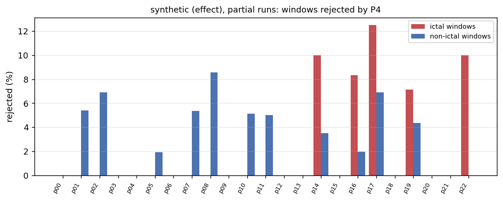
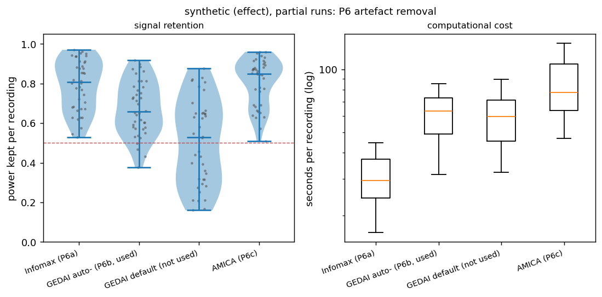
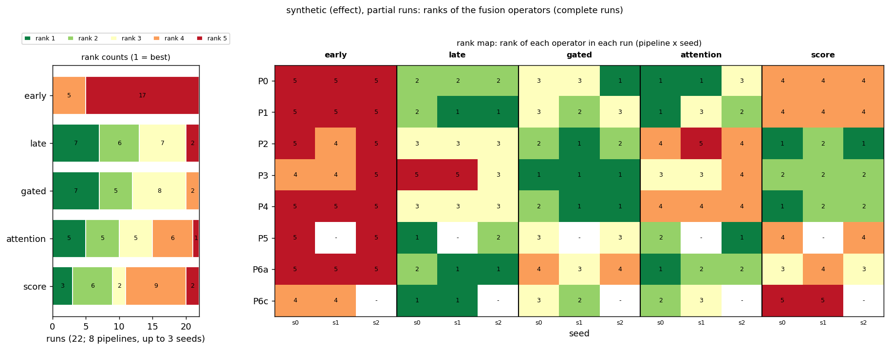

> Example output of `python -m src.multiverse --first-report`, produced by the synthetic validation (`python -m src.multiverse --synthetic`, folder `first_report/`): synthetic runs with an injected Fusion x Preprocessing effect, of which P6b has not run, P6c seed 2 is missing and P5 seed 1 is still in progress. P4's corpus and the P6 logs are synthetic too. **No number here is a result.**

# First results: synthetic (effect), partial runs

The three items requested first: P4's rejection distribution, P6's signal retention, and the first rank stability table of the pipelines. Generated from the runs available now; rerun as more arrive (`python -m src.multiverse --dataset chbmit --first-report`).

## Runs included

22 complete run(s) (23 folds each) are included; 1 incomplete run(s) are not (loso_P5_r1). `-` = not run yet.

| pipeline | seed 0 | seed 1 | seed 2 |
|---|---|---|---|
| P0 | yes | yes | yes |
| P1 | yes | yes | yes |
| P2 | yes | yes | yes |
| P3 | yes | yes | yes |
| P4 | yes | yes | yes |
| P5 | yes | partial (10/23) | yes |
| P6a | yes | yes | yes |
| P6b | - | - | - |
| P6c | yes | yes | - |

## 1. P4: windows rejected as technical artefacts

Rejected by the rule (from meta.json of 3 P4 run(s), identical in all): 5 of 218 ictal windows (2.3 %) and 22 of 1006 non-ictal windows (2.2 %). Rejected windows leave training and validation only; the test windows are those of every other pipeline.

Per person (23 persons; 12 with at least one rejected window; median share 1.54 %, maximum 8.1 % (p17)):

| person | windows | ictal_total | ictal_rejected | nonictal_total | nonictal_rejected | rejected_pct |
|---|---|---|---|---|---|---|
| p00 | 52 | 8 | 0 | 44 | 0 | 0.00 |
| p01 | 44 | 7 | 0 | 37 | 2 | 4.55 |
| p02 | 35 | 6 | 0 | 29 | 2 | 5.71 |
| p03 | 64 | 11 | 0 | 53 | 0 | 0.00 |
| p04 | 60 | 8 | 0 | 52 | 0 | 0.00 |
| p05 | 65 | 13 | 0 | 52 | 1 | 1.54 |
| p06 | 64 | 10 | 0 | 54 | 0 | 0.00 |
| p07 | 69 | 13 | 0 | 56 | 3 | 4.35 |
| p08 | 41 | 6 | 0 | 35 | 3 | 7.32 |
| p09 | 51 | 10 | 0 | 41 | 0 | 0.00 |
| p10 | 47 | 8 | 0 | 39 | 2 | 4.26 |
| p11 | 46 | 6 | 0 | 40 | 2 | 4.35 |
| p12 | 62 | 16 | 0 | 46 | 0 | 0.00 |
| p13 | 69 | 14 | 0 | 55 | 0 | 0.00 |
| p14 | 67 | 10 | 1 | 57 | 2 | 4.48 |
| p15 | 46 | 10 | 0 | 36 | 0 | 0.00 |
| p16 | 63 | 12 | 1 | 51 | 1 | 3.17 |
| p17 | 37 | 8 | 1 | 29 | 2 | 8.11 |
| p18 | 30 | 4 | 0 | 26 | 0 | 0.00 |
| p19 | 60 | 14 | 1 | 46 | 2 | 5.00 |
| p20 | 63 | 8 | 0 | 55 | 0 | 0.00 |
| p21 | 32 | 6 | 0 | 26 | 0 | 0.00 |
| p22 | 57 | 10 | 1 | 47 | 0 | 1.75 |

## 2. P6: signal retention of Infomax, GEDAI and AMICA

Source: synthetic logs in the data/ica_logs layout (160 logs). Power kept = signal power after cleaning / before, per recording.

| pipeline | method | recordings | power_kept_median | q25 | q75 | min | share_below_0.5 | share_below_0.9 | components_removed_mean | share_none_removed |
|---|---|---|---|---|---|---|---|---|---|---|
| P6a | Infomax (P6a) | 40 | 0.807 | 0.678 | 0.908 | 0.528 | 0.000 | 0.725 | 1.650 | 0.250 |
| P6b | GEDAI auto- (P6b, used) | 40 | 0.658 | 0.576 | 0.783 | 0.376 | 0.100 | 0.975 |  |  |
| P6b-default | GEDAI default (not used) | 40 | 0.528 | 0.317 | 0.651 | 0.160 | 0.475 | 1.000 |  |  |
| P6c | AMICA (P6c) | 40 | 0.849 | 0.691 | 0.894 | 0.509 | 0.000 | 0.775 | 1.625 | 0.200 |

Computational cost (for the supplementary material; `p6_cost.csv`). Seconds are the logged processing time of each recording, summed for the total:

| pipeline | method | recordings | median_s_per_recording | mean_s_per_recording | total_compute_h | components_removed_median | components_removed_mean |
|---|---|---|---|---|---|---|---|
| P6a | Infomax (P6a) | 40 | 29.35 | 29.98 | 0.33 | 2.00 | 1.65 |
| P6b | GEDAI auto- (P6b, used) | 40 | 63.03 | 61.11 | 0.68 |  |  |
| P6b-default | GEDAI default (not used) | 40 | 59.38 | 60.47 | 0.67 |  |  |
| P6c | AMICA (P6c) | 40 | 77.59 | 84.22 | 0.94 | 2.00 | 1.62 |

## 3. Rank stability of the fusion operators (first table)

Mean macro F1 over 23 folds and the available seeds, with the operator's rank in that pipeline (1 = best) and, where seeds disagree, the range of its single-seed ranks:

| pipeline | seeds | early | late | gated | attention | score | best | Kendall W (seeds) |
|---|---|---|---|---|---|---|---|---|
| P0 | 3 | 0.684 (5) | 0.766 (2) | 0.764 (3; 1-3) | 0.768 (1; 1-3) | 0.711 (4) | attention | 0.82 |
| P1 | 3 | 0.648 (5) | 0.737 (1; 1-2) | 0.726 (3; 2-3) | 0.734 (2; 1-3) | 0.685 (4) | late | 0.89 |
| P2 | 3 | 0.710 (5; 4-5) | 0.718 (3) | 0.738 (2; 1-2) | 0.714 (4; 4-5) | 0.738 (1; 1-2) | score | 0.91 |
| P3 | 3 | 0.682 (4; 4-5) | 0.681 (5; 3-5) | 0.707 (1) | 0.683 (3; 3-4) | 0.702 (2) | gated | 0.87 |
| P4 | 3 | 0.711 (5) | 0.724 (3) | 0.739 (1; 1-2) | 0.719 (4) | 0.737 (2; 1-2) | gated | 0.96 |
| P5 | 2 | 0.660 (5) | 0.753 (2; 1-2) | 0.742 (3) | 0.755 (1; 1-2) | 0.697 (4) | attention | 0.95 |
| P6a | 3 | 0.714 (5) | 0.798 (1; 1-2) | 0.741 (4; 3-4) | 0.793 (2; 1-2) | 0.743 (3; 3-4) | late | 0.91 |
| P6c | 2 | 0.716 (4) | 0.759 (1) | 0.742 (3; 2-3) | 0.744 (2; 2-3) | 0.668 (5) | late | 0.95 |

AUPRC (the second primary metric), seed mean per pipeline and operator:

| pipeline | early | late | gated | attention | score |
|---|---|---|---|---|---|
| P0 | 0.623 | 0.624 | 0.620 | 0.622 | 0.622 |
| P1 | 0.638 | 0.635 | 0.639 | 0.637 | 0.636 |
| P2 | 0.647 | 0.646 | 0.647 | 0.648 | 0.646 |
| P3 | 0.641 | 0.645 | 0.639 | 0.643 | 0.641 |
| P4 | 0.645 | 0.650 | 0.645 | 0.651 | 0.651 |
| P5 | 0.640 | 0.650 | 0.648 | 0.648 | 0.651 |
| P6a | 0.646 | 0.645 | 0.645 | 0.643 | 0.642 |
| P6c | 0.659 | 0.653 | 0.657 | 0.657 | 0.653 |

Over all included runs (rank counts, median, best and worst rank, share of runs won):

| model | rank 1 | rank 2 | rank 3 | rank 4 | rank 5 |
|---|---|---|---|---|---|
| early | 0 | 0 | 0 | 5 | 17 |
| late | 7 | 6 | 7 | 0 | 2 |
| gated | 7 | 5 | 8 | 2 | 0 |
| attention | 5 | 5 | 5 | 6 | 1 |
| score | 3 | 6 | 2 | 9 | 2 |

| model | n_runs | mean_rank | median_rank | best_rank | worst_rank | share_first | share_last |
|---|---|---|---|---|---|---|---|
| early | 22 | 4.77 | 5.00 | 4 | 5 | 0.00 | 0.77 |
| late | 22 | 2.27 | 2.00 | 1 | 5 | 0.32 | 0.09 |
| gated | 22 | 2.23 | 2.00 | 1 | 4 | 0.32 | 0.00 |
| attention | 22 | 2.68 | 3.00 | 1 | 5 | 0.23 | 0.05 |
| score | 22 | 3.05 | 3.50 | 1 | 5 | 0.14 | 0.09 |

Kendall tau between the seed-averaged rankings of the pipelines:

| pipeline | P0 | P1 | P2 | P3 | P4 | P5 | P6a | P6c |
|---|---|---|---|---|---|---|---|---|
| P0 | 1.00 | 0.80 | -0.20 | 0.00 | 0.00 | 1.00 | 0.60 | 0.60 |
| P1 | 0.80 | 1.00 | 0.00 | -0.20 | 0.20 | 0.80 | 0.80 | 0.80 |
| P2 | -0.20 | 0.00 | 1.00 | 0.40 | 0.80 | -0.20 | 0.20 | -0.20 |
| P3 | 0.00 | -0.20 | 0.40 | 1.00 | 0.60 | 0.00 | -0.40 | -0.40 |
| P4 | 0.00 | 0.20 | 0.80 | 0.60 | 1.00 | 0.00 | 0.00 | 0.00 |
| P5 | 1.00 | 0.80 | -0.20 | 0.00 | 0.00 | 1.00 | 0.60 | 0.60 |
| P6a | 0.60 | 0.80 | 0.20 | -0.40 | 0.00 | 0.60 | 1.00 | 0.60 |
| P6c | 0.60 | 0.80 | -0.20 | -0.40 | 0.00 | 0.60 | 0.60 | 1.00 |

Window-level macro F1 (seed means) is the metric here; AUPRC and the full multiverse analysis follow in `python -m src.multiverse` once the balanced block is complete. Event-based metrics are secondary (docs/EVENTS.md).
