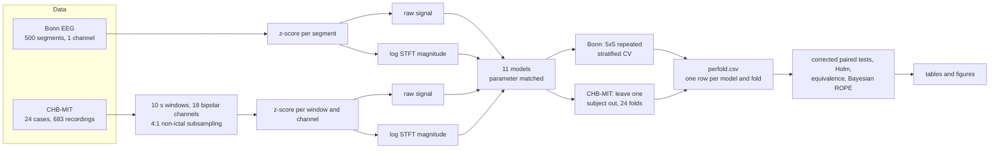

# Pipeline and Methodology

This document describes, end to end, how every number in `paper/manuscript.md` is
produced: data, preprocessing, models, training, evaluation, and statistical analysis.
Every setting below is taken from the code, not from memory, and each section names the
file that implements it. Open issues are listed in Section 9 rather than left implicit.

## 0. Overview

The research question is narrow on purpose: with the backbone, training protocol, and
parameter budget held fixed, does the choice of fusion operator make a difference that
survives a statistically valid test? No new architecture is proposed.

## 1. Data

### 1.1 Bonn (Andrzejak et al. 2001)

| Property | Value |
|---|---|
| Sets | A, B: scalp EEG, healthy volunteers. C, D: intracranial, interictal. E: intracranial, ictal |
| Size | 100 segments per set, 500 total |
| Segment | 4097 samples, 23.6 s, single channel |
| Sampling rate | 173.61 Hz |
| Acquisition filter | 0.53 to 40 Hz band pass, already applied in the published data |
| Subject identifiers | None published |

Three task formulations (`src/config.py: TASKS`):

| Task | Classes | Purpose |
|---|---|---|
| T1 | A+B vs C+D vs E (3 classes) | Main benchmark |
| T2 | C+D vs E | Intracranial only, removes the scalp versus intracranial recording confound |
| T3 | A+B+C+D vs E | The binary split most used in the literature; kept as a reference because a single feature logistic regression already reaches 0.954 macro F1 on it |

Because Bonn publishes no subject identifiers, cross validation on Bonn is necessarily
segment wise, and no Bonn result speaks to generalisation across patients. This is why
CHB-MIT is used as an external validation corpus.

### 1.2 CHB-MIT (Shoeb 2009; Goldberger et al. 2000, PhysioNet)

| Property | Value |
|---|---|
| Cases | 24 case folders, chb01 to chb24. At most 23, and by PhysioNet's own documentation at least 22, distinct individuals: chb21 is the same subject as chb01, recorded 1.5 years later (Section 9) |
| Recordings | 686 EDF files, 982.9 hours, 198 annotated seizures |
| Sampling rate | 256 Hz |
| Montage used | Fixed 18 channel bipolar montage (`src/chbmit.py: TARGET_CHANNELS`): FP1-F7, F7-T7, T7-P7, P7-O1, FP1-F3, F3-C3, C3-P3, P3-O1, FP2-F4, F4-C4, C4-P4, P4-O2, FP2-F8, F8-T8, T8-P8, P8-O2, FZ-CZ, CZ-PZ |
| Retained | 683 of 686 recordings, 185 of 198 seizures. The dropped ones are all from part of chb12, which uses a different reference montage sharing no channel with the target |

Data integrity and loading (`src/chbmit.py`, `src/verify_chbmit.py`):

- Files are verified against sizes computed from each EDF header, not against file
  listings.
- EDF is read by a small custom reader; no external EDF library is needed.
- Seizure annotations are parsed from each case's summary file **by sequence**, not by
  the printed seizure number, and each file's parsed count is checked against its
  declared "Number of Seizures". This is needed because `chb09-summary.txt` contains a
  labelling error (a seizure end line printed with the wrong number) that a number based
  parser turns into a nonexistent 6316 second seizure.
- PhysioNet's `RECORDS-WITH-SEIZURES` index names `chb07_18.edf` where the summary and
  annotation files agree it should be `chb07_19.edf`. The summary files are treated as
  ground truth.

Windowing and labels (`src/chbmit.py: plan_windows`, `src/chbmit_corpus.py: build_corpus`):

| Step | Setting |
|---|---|
| Window | 10 s (2560 samples), non overlapping |
| Label | Ictal if the window overlaps an annotated seizure at all. 948 of the 1,276 ictal windows lie entirely within a seizure; 328 (25.7 percent) are boundary windows with a median of 5.0 s of seizure. Excluding boundary windows is implemented (`guard_s`) but not yet run |
| Class balance | Ictal windows are 0.34 percent of all windows. Non ictal windows are subsampled per case to 4 per ictal window, seed 20260727 |
| Final corpus | 6,380 windows (1,276 ictal), 24 cases, 18 channels x 2560 samples |
| Grouping | Every window carries its case id and, if ictal, a persistent seizure id (for example `chb09_08.edf#2`) used by the leakage checks |

Labels are planned from EDF headers alone in a first pass, and only the selected
windows are read from disk in a second pass, so the 43 GB corpus never has to fit in
memory.

## 2. Preprocessing and model inputs

Each example is presented to the models in two representations of the same signal:
the raw waveform and its spectrogram.

| | Bonn (`src/data.py`) | CHB-MIT (`src/chbmit_prep.py`) |
|---|---|---|
| Signal normalisation | z-score per segment | z-score per window and per channel |
| Spectrogram | log(1 + \|STFT\|), computed from the z-scored signal | log(1 + \|STFT\|), computed from the z-scored signal |
| STFT | Hann window 256, hop 128, nfft 256 | Hann window 256, hop 128, nfft 256 |
| Frequency ceiling | 40 Hz (acquisition limit) | 64 Hz (the largest measured ictal to interictal power ratio is in the 30 to 70 Hz band) |
| Line noise | none needed | optional 60 Hz notch, off by default because it overlaps the gamma band |
| Raw input shape | 1 x 4097 | 18 x 2560 |
| Spectrogram shape | 1 x 59 x 31 (freq x time) | 18 x 65 x 19 |

The Bonn normalisation choice is itself ablated (`src/config.py: NORM_MODES`): N0 no
normalisation, N1 z-scored signal but spectrogram from the raw signal (the configuration
the original notebook implementation ran by accident), N2 both from the z-scored signal
(main), N3 additionally z-scoring the spectrogram.

## 3. Models (`src/models.py`)

### 3.1 Backbones

- **CNN1D** (raw signal): three blocks of Conv1d (kernel 7) + BatchNorm + ReLU + MaxPool(2),
  widths 16, 32, 64, then global average pooling and a linear layer to a 128 dimensional
  embedding.
- **CNN2D** (spectrogram): three blocks of Conv2d (3x3) + BatchNorm + ReLU + MaxPool(2x2),
  widths 16, 32, 64, then global average pooling and a linear layer to 128 dimensions.

For CHB-MIT only the first layer changes, to accept 18 input channels. With one input
channel every Bonn parameter count is identical to before this change; this was verified
directly.

### 3.2 The eleven models

| Model | What it is |
|---|---|
| raw1d | CNN1D + dropout 0.3 + linear classifier |
| spec2d | CNN2D + dropout 0.3 + linear classifier |
| raw1d_wide | raw1d with widths scaled up so its total parameter count matches the fusion models |
| spec2d_wide | same for spec2d |
| late | concatenate the two embeddings, then MLP, then classifier |
| gated | g = sigmoid(MLP([z1, z2])), fused z = g * z1 + (1 - g) * z2 (per dimension) |
| attention | (a1, a2) = softmax(MLP([z1, z2])), fused z = a1 * z1 + a2 * z2 (per modality) |
| early | the raw signal passes through a small strided Conv1d encoder, is aligned to the spectrogram's time axis, broadcast along frequency, and appended to the spectrogram as 8 extra channels; one 2D CNN then processes both. Strictly this is intermediate fusion, since a 1D signal and a 2D spectrogram cannot be concatenated at the raw input level, and the manuscript says so |
| score | raw1d and spec2d trained independently; their softmax outputs are averaged with weight w chosen on the validation set only (41 point grid from 0 to 1, minimising validation log loss; `src/train.py: best_blend_weight`) |
| logvar | logistic regression on the log variance of the signal (one feature per channel) |
| shallow | logistic regression on 7 features per channel: log variance, log line length, and relative power in 5 bands (0.5 to 4, 4 to 8, 8 to 13, 13 to 30, and 30 to 40 Hz on Bonn or 30 to 64 Hz on CHB-MIT) |

The two classical baselines use a standard scaler and `class_weight="balanced"`
(`src/baselines.py`, `src/chbmit_baselines.py`). They are there to show how much of the
task a hand engineered linear model already solves.

### 3.3 Parameter matching

A fusion model contains two branches, so it is naturally larger than either unimodal
model; if it wins, the win cannot be attributed to fusion rather than capacity. Every
jointly trained variant is therefore sized to a common budget: the hidden width of each
fusion head is solved in closed form per operator (`_solve_hidden`), and the widened
unimodal controls use calibrated width multipliers.

| Model | Bonn T1 (3 classes) | CHB-MIT (2 classes, 18 ch) |
|---|---|---|
| raw1d | 27,075 | 28,850 |
| spec2d | 32,227 | 34,546 |
| raw1d_wide | 99,795 | 103,712 |
| spec2d_wide | 97,775 | 102,236 |
| late | 98,571 | 102,768 |
| gated | 98,698 | 102,921 |
| attention | 98,544 | 102,767 |
| early | 97,507 | 102,547 |
| score | 59,302 (sum of raw1d and spec2d) | 63,396 |

Spread across the four jointly trained fusion operators: 1.2 percent on Bonn, 0.36
percent on CHB-MIT. Score fusion is reported at its natural size, because forcing it to
the common budget would mean shrinking its two constituent classifiers.

## 4. Training

| | Bonn (`src/train.py`) | CHB-MIT (`src/chbmit_run.py: train_fold`) |
|---|---|---|
| Optimiser | AdamW, lr 1e-3, weight decay 1e-4 | Adam, lr 1e-3, weight decay 1e-4 (see Section 9) |
| Loss | cross entropy, class weighted | cross entropy, class weighted |
| Batch size | 32 | 32 |
| Epochs | max 60, min 20 | max 60, min 20 |
| Early stopping | validation macro F1, patience 12, only after the minimum epochs | same |
| Checkpoint | weights from the best validation epoch | same |
| Seed | deterministic per (repeat, fold, model): SHA-1 of base seed 20260727 and the triple (`src/config.py: fold_seed`) | same, per (fold, model) |

The 20 epoch minimum is not cosmetic. Without it, early stopping could trigger while a
model was still predicting a single class for every example: validation F1 stayed flat,
patience ran out around epoch 11, and the collapsed weights were kept as "best". Those
runs showed AUC 0.96 with macro F1 0.40.

## 5. Evaluation protocol

### 5.1 Bonn

- 5 x 5 repeated stratified k-fold cross validation (`StratifiedKFold`, 5 folds, 5
  repeats), giving 25 test measurements per model.
- Inside each training fold, a stratified 20 percent validation split
  (`StratifiedShuffleSplit`) is used for early stopping and for the score fusion weight.
  The test fold is never used for any choice.

### 5.2 CHB-MIT

- Leave one subject out: 24 folds, each holding out one case.
- The inner validation split is **subject wise**: about 20 percent of the training cases
  (5 of 23) are held out entirely, chosen evenly along a list sorted by ictal count so the
  validation set always contains seizures (`inner_split`). A window wise inner split would
  put windows from the same patient in both training and validation and inflate the early
  stopping decision.
- Two leakage rules are enforced: no case's windows in both train and test, and no single
  seizure's windows split across train and test (`src/chbmit_corpus.py: check_leakage`).
  The checker itself was validated by building a deliberately leaky random split and
  confirming it is flagged on both rules. See Section 9 for the one known exception.

### 5.3 Metrics (`src/evaluate.py`)

Macro F1 is the primary metric. Also recorded: accuracy, macro precision and recall,
AUC, log loss, Brier score, per class F1 and recall, and on CHB-MIT sensitivity,
specificity, and false alarm counts. Every model and fold produces one row in
`perfold.csv`; everything downstream is computed from those files.

## 6. Statistical analysis (`src/stats.py`, `src/phase0.py`, `src/chbmit_stats.py`)

### 6.1 Why the usual test is not valid here

Repeated cross validation measurements are not independent: the training sets of
different folds and repeats overlap heavily. The paired Wilcoxon or t test commonly used
in this literature assumes independence. A simulation (`src/sim_cv_correlation.py`) with
two statistically identical classifiers under 5 x 5 repeated CV over 1000 datasets found
false positive rates of 37.6 percent (Wilcoxon) and 38.6 percent (paired t test), against
a nominal 5 percent. The corrected test below rejected in 2.3 percent.

### 6.2 Tests used

| Question | Method |
|---|---|
| Is there a difference? | Corrected resampled paired t test (Nadeau and Bengio 2003; Bouckaert and Frank 2004): the squared standard error of the mean difference is s² (1/n + n_test/n_train) instead of s²/n. Holm correction across all pairs within a task and metric |
| Is the difference negligible? | Equivalence bound δmin: the smallest margin within which the pair is equivalent at alpha 0.05 (two one sided tests), computed with the same corrected variance |
| How probable is practical equivalence? | Correlated Bayesian t test (Corani and Benavoli 2015) with a region of practical equivalence of ±0.01 and ±0.02 macro F1: posterior probabilities that A is better, that they are practically equivalent, that B is better |
| Robustness check | Sign test, which does not assume symmetric differences |

### 6.3 The test to train ratio

The primary analysis uses the standard ratio 1/(k-1): 0.25 for Bonn (5 folds) and 1/23
for CHB-MIT LOSO. Because both protocols also remove a validation split from the training
data, every test is recomputed with a conservative ratio based on the data actually used
for fitting: 0.3125 for Bonn and 1/18 for CHB-MIT (column `p_corrected_conservative`). No
conclusion changes: the number of significant pairs is identical in all four analyses
(10 of 55 on Bonn T1; 0 of 55 on Bonn T2, T3, and CHB-MIT) and the equivalence bounds of
the fusion operator pairs widen by at most 0.005 macro F1.

### 6.4 How to read the results

"Not significantly different" and "equivalent" are separate claims and are reported
separately. On Bonn the fusion operators are both not different and positively shown to
be close. On CHB-MIT they are not different, but between subject variance is so large
that closeness cannot be shown either. The manuscript treats these as two different kinds
of negative result.

## 7. Reproducibility

- **Configuration hashing.** Every Bonn run writes to `results_v2/<task>__<norm>__<hash>/`,
  where the hash covers every configuration field, so results produced with different
  settings cannot overwrite each other. Each run also writes `config.json` and
  `env.json` (library versions, platform, effective thread count).
- **Thread count matters.** The number of CPU threads changes the floating point
  summation order in multithreaded convolution routines. At a fixed thread count results
  are bit for bit repeatable (verified with three identical runs); changing the thread
  count alone moves per fold macro F1 by up to 0.093 on Bonn and 0.208 in one CHB-MIT
  fold, comparable to the differences between operators. Thread count is therefore part
  of the run identity (`docs/10_OLASILIK_VE_TEKRARLANABILIRLIK.md`).
- **Numerical realisations in the manuscript.** Bonn Table 2 comes from the original runs
  at 2 threads. The Bonn log loss and Brier analysis comes from a 12 thread rerun that also
  stored predicted probabilities (`results_v2/rerun_probs/`). CHB-MIT folds 0 to 4 were
  trained at 12 threads and folds 5 to 23 at 6 threads, after a thermal slowdown forced a
  restart. These are stated in the manuscript where they apply.

## 8. Reproducing each result

Raw data goes under `data/` (not in the repository): Bonn sets as `data/A` to `data/E`,
CHB-MIT as `data/chbmit/chbNN/`. `docs/11_CHBMIT_PLANI.md` documents the CHB-MIT download
and verification. Stored results for every step below are already in `results_v2/`, so
the statistics and figures can be regenerated without the raw data or a GPU.

| Result | Command | Output |
|---|---|---|
| Bonn main runs (Table 2) | `python -m src.run_benchmark --task T1_3class --norm N2_z_zspec --threads 2` (likewise `T2_intracranial_binary`, `T3_classic_binary`), or `bash run_all.sh` | `results_v2/T*_N2_z_zspec_*/perfold.csv` |
| Bonn normalisation ablation | `python -m src.run_benchmark --task T1_3class --norm N1_z_rawspec --threads 2` | `results_v2/T1_3class__N1_*` |
| Bonn probability rerun | `python -m src.run_benchmark --task T1_3class --norm N2_z_zspec --threads 12 --outdir results_v2/rerun_probs/T1_3class__N2` | `results_v2/rerun_probs/` |
| Bonn sensitivity (STFT resolution, parameter budget) | `python -m src.run_sensitivity --list`, then `--axis <axis> --variant <variant>` | `results_v2/sensitivity/` |
| Bonn statistics | `python -m src.phase0` and `python -m src.phase0_probscores` | `results_v2/phase0/` |
| Naive test simulation | `python -m src.sim_cv_correlation` | printed |
| CHB-MIT integrity check | `python -m src.verify_chbmit` | printed |
| CHB-MIT corpus and leakage check | `python -m src.chbmit_corpus` | printed, cached corpus |
| CHB-MIT deep models (Table 3) | `python -m src.chbmit_run --split loso --threads 6 --tag loso_main` | `results_v2/chbmit/loso_main/perfold.csv` |
| CHB-MIT classical baselines | `python -m src.chbmit_baselines` | appended to the same file |
| CHB-MIT score fusion | `python -m src.chbmit_score --threads 6` | appended to the same file |
| CHB-MIT statistics | `python -m src.chbmit_stats` | `results_v2/chbmit/phase0/` |
| Manuscript figures | `python -m src.make_manuscript_figures` | `paper/figures_manuscript/` |

## 9. Known issues and open items

These are also listed in the manuscript's Limitations section.

1. **chb01 and chb21 are the same person.** Subject grouping uses case folder names, so
   the fold holding out chb01 trains on chb21 and vice versa. On the chb01 fold every
   model scores far above its own mean (late fusion 0.981 against 0.675). Excluding that
   fold lowers each model's mean macro F1 by 0.006 to 0.013 and leaves the ranking largely
   unchanged (Spearman rho 0.88). Fix: merge chb01 and chb21 into one held out subject and
   rerun LOSO.
2. **Boundary windows.** 25.7 percent of CHB-MIT ictal windows only partly overlap a
   seizure. Whether to keep them is a design choice whose effect has not been measured.
3. **Optimiser differs between corpora.** Bonn uses AdamW (decoupled weight decay),
   CHB-MIT uses Adam with L2 weight decay. This should be unified before final runs.
4. **No CHB-MIT sensitivity analysis yet** (window length, frequency ceiling, notch,
   subsampling ratio, boundary windows), unlike Bonn.
5. **False alarms per hour are not reported**, because the rate on the subsampled time
   base would not be clinically meaningful; computing it on the true recording duration is
   still to do.
6. **Mixed thread counts** within the CHB-MIT run (Section 7).
7. **Code comments are in Turkish**, and the detailed working notes in `docs/` are
   Turkish. The manuscript, this document, and the README are in English.
