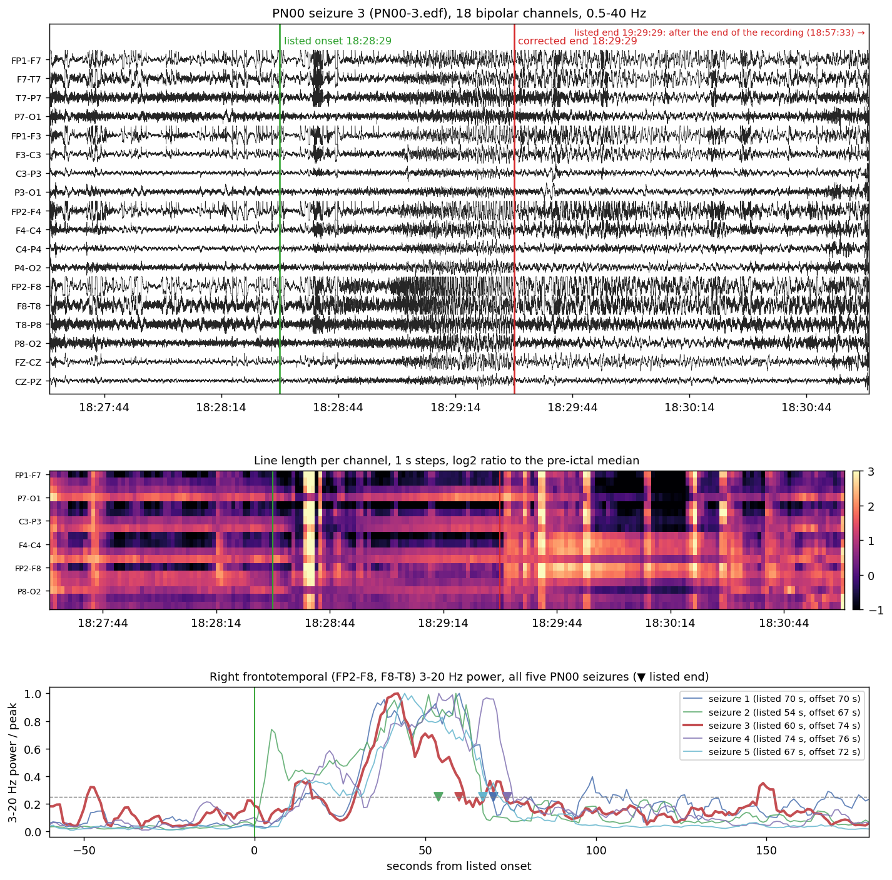

# Siena Scalp EEG

The third corpus. Bonn is the controlled proof of concept, CHB-MIT the primary
subject-independent evaluation, and Siena an external check: a different hospital,
amplifier and montage, and adults instead of children. This document covers getting
the data into the CHB-MIT form; no model has been trained on it yet.

## 1. Source and license

| Property | Value |
|---|---|
| Source | PhysioNet, `siena-scalp-eeg` v1.0.0, https://physionet.org/content/siena-scalp-eeg/1.0.0/ (mirror used for downloads: https://physionet-open.s3.amazonaws.com/siena-scalp-eeg/1.0.0/) |
| License | Creative Commons Attribution 4.0 International |
| Cite | Detti, Vatti, Zabalo Manrique de Lara (2020), *EEG synchronization analysis for seizure prediction: a study on data of noninvasive recordings*, Processes 8(7):846; Detti (2020), PhysioNet, doi:10.13026/5d4a-j060; Goldberger et al. (2000), Circulation 101(23) |
| Patients | 14 adults (PN00, PN01, PN03, PN05, PN06, PN07, PN09, PN10, PN11, PN12, PN13, PN14, PN16, PN17), one recording session each |
| Recordings | 41 EDF files, 141.0 hours by the EDF headers (the description says about 128; Section 8), 20.3 GB; every recording contains at least one seizure |
| Seizures | 47, 47.7 minutes in total, median 63 s (PN10's ten seizures last 5 to 69 s) |
| Sampling rate | 512 Hz |
| Montage | referential 10-20 with older names (T3, T4, T5, T6), 29 EEG electrodes (19 in PN10's seizure list), plus EKG and other signals |
| Annotations | `PNxx/Seizures-list-PNxx.txt`: wall-clock times (hh.mm.ss) of each recording's start and end and of each seizure's start and end |

## 2. Conversion to the CHB-MIT form (`src/siena.py`)

| Step | Setting |
|---|---|
| Channels | the 18 bipolar channels of `src/chbmit.py: TARGET_CHANNELS`, same names and order, derived by subtraction: FP1-F7 = Fp1 - F7, T7-P7 = T3 - T5, P8-O2 = T6 - O2, and so on (T7 = T3, T8 = T4, P7 = T5, P8 = T6) |
| Electrodes needed | 19: Fp1, Fp2, F3, F4, F7, F8, Fz, C3, C4, Cz, P3, P4, Pz, O1, O2, T3, T4, T5, T6; present in all 41 recordings |
| Label matching | case-insensitive, `EEG ` prefix removed (`EEG Fp2` and `EEG FP2`, `EEG Cz` and `EEG CZ` both occur) |
| Unit | microvolts; the physical dimension of every needed electrode is `uV` in all 41 headers, checked on every read |
| Resampling | 512 to 256 Hz with `scipy.signal.resample_poly(x, 1, 2, axis=-1)` on the continuous bipolar recording, before windowing |
| Preprocessing hook | `signal_fn(x, fs, key)` runs on the continuous 256 Hz bipolar signal, as in CHB-MIT, so the P0-P6 pipelines of `src/preprocess.py` apply unchanged |
| Memory | only the 19 needed electrodes are converted to float; the longest recording (PN14-3, 11.7 hours, 2.1 GB) stays within a few GB |

Windowing, labelling, subsampling (4 non-ictal per ictal window, within each subject,
seed 20260727), the leakage checks and the corpus validation are CHB-MIT's own
functions (`src/siena_corpus.py`). Each subject is its own person group: 14 LOSO folds.

## 3. Header audit

`python -m src.siena_download --audit` reads only the EDF headers (256 bytes plus 256
per signal, about 0.5 MB) and compares them with the seizure lists. Result for all 41
recordings:

| Check | Result |
|---|---|
| File size equals the size computed from the header | 41/41 |
| Sampling rate | 512 Hz in every recording and every signal |
| All 19 electrodes present | 41/41 |
| Electrode unit | `uV` everywhere |
| O1 label | `EEG O1` in every header (the lists say "Channel 5: 1") |
| List start time equals the EDF header start time | 39/41. PN14-3: list 16.17.45, header 19.17.45. PN05-3: list 06.01.23, header 06.01.13 |
| List end time equals header start + duration | 22/41. In 18 of the other 19 the list end is exactly 20 s earlier; in PN05-3 it is 10 s earlier |

**Which start time is used.** Seizure times are converted relative to the EDF header
start time, modulo 24 hours, for every recording. The header start time is by
definition the time of the first sample, and it agrees with the list for 39
recordings. For PN14-3 the header is right: its start plus the recording duration
gives the listed end time exactly, while the listed start would make the recording
three hours longer than the file. PN05-3 is not settled (Section 5.3).

**The 20 s end offset.** In 18 recordings the file runs exactly 20 s past the listed
registration end. The start times agree, so seizure times are unaffected; the most
likely reading is that the listed end was noted before the recording was stopped.

## 4. Problems in the seizure lists and how they are handled

All fixes are in one dictionary, `src/siena.py: CORRECTIONS`, each with its reason.
The parser is strict: a time it cannot read unambiguously raises an error instead of
being guessed.

| Problem | Where | Handling |
|---|---|---|
| Mixed time separators: `19.58.36`, `21:51:02`, `16:13.23` | several lists | `.` and `:` both accepted, also mixed |
| Space inside a time: `1 6.49.25` | PN10, seizure 7 | text replacement to `16.49.25` (matches the next two blocks and the header) |
| No space after the colon: `Registration start time:14.18.30` | PN03, PN05, PN06, PN10, PN14 | accepted |
| Misspelt file names: `PN01.edf`, `PNO6-1.edf`, `PNO6-2.edf`, `PNO6-4.edf` (letter O), `PN11-.edf` | PN01, PN06, PN11 | mapped to the names in RECORDS |
| File name and registration times before "Seizure n 1" | PN01 | sequential parser: the context applies to both seizures |
| No registration times for seizure 2 | PN12 | taken from seizure 1 of the same file; only the blocks listed in `CORRECTIONS["inherited_registration"]` may do this |
| Recordings past midnight | PN01, PN03, PN06-2, PN07, PN14-3, PN16-2 | times taken modulo 24 hours |
| Channel 5 named `1` | all lists | channels are taken from the EDF headers (`EEG O1`), never from the lists |
| Wrong registration start time | PN14-3, PN05-3 | the EDF header start time is used (Sections 3 and 5.3) |
| Two times in one field | PN10 seizures 2 and 3 | resolved by `DECISIONS` (Section 5); any other multi-time field raises |
| Clinical onset only | PN10 seizure 6 | used as listed and flagged in the seizure notes (Section 5.2) |

## 5. Decisions

Both options of each ambiguity are implemented; the active choice is the `DECISIONS`
constant at the top of `src/siena.py`, part of the corpus cache name, and recorded in
the corpus info. The values are the advisor's decisions, applied after the checks in
`src/siena_qc.py` (`python -m src.siena_qc`).

| Key | Problem | Main analysis | Alternative (implemented) |
|---|---|---|---|
| `PN00_seizure3` | PN00-3: end `19.29.29`, after the recording ends (18.57.33) | `typo`: 18.29.29, a 60 s seizure, **confirmed by the signal** (5.1) | `exclude`: the seizure and every window from its onset to the end of the recording are dropped |
| `PN10_seizure3_onset` | PN10-3: `15.43.53 (CLINICAL ONSET); 15.43.59 (ELECTRIC ONSET)` | `electric`: 15.43.59 (5.2) | `clinical`: 15.43.53 |
| `PN10_seizure2_end` | PN10-2: end `11.41.04 opure 11.40.43` (Italian "oppure", "or") | `first`: 11.41.04 | `second`: 11.40.43 |

### 5.1 PN00 seizure 3

**Rule (advisor):** use the 18.29.29 end as a documented metadata correction only if
the signal shows the seizure ending about 60 s after onset; otherwise drop the seizure
and every window touching it from the main analysis.

**Check.** PN00's seizures are right temporal (`subject_info.csv`), and in all five the
ictal discharge is clearest on the right frontotemporal chain (FP2-F8, F8-T8) as an
evolving 3-20 Hz rhythm. Its power is computed in 1 s steps (smoothed over 5 s), and the
signal offset is the first second after the peak from which the power stays below a
quarter of the peak for 10 s. The same rule is applied to all five seizures:

| Seizure | Listed onset | Listed end | Listed duration | Rhythm peak | Signal offset | Offset - listed end |
|---|---|---|---|---|---|---|
| 1 | 19.58.36 | 19.59.46 | 70 s | +60 s | +70 s | +0 s |
| 2 | 02.38.37 | 02.39.31 | 54 s | +59 s | +67 s | +13 s |
| **3** | **18.28.29** | **18.29.29** (corrected) | **60 s** | **+42 s** | **+74 s** | **+14 s** |
| 4 | 21.08.29 | 21.09.43 | 74 s | +54 s | +76 s | +2 s |
| 5 | 22.37.08 | 22.38.15 | 67 s | +44 s | +72 s | +5 s |

**Result: the correction is supported.** Seizure 3's rhythm ends 14 s after the
corrected end, in line with the other four seizures (0 to 13 s after their listed ends,
all measured the same way); the listed 19.29.29 lies 1916 s after the end of the
recording. `PN00_seizure3` stays `typo`. The traces show the rhythmic discharge on
FP2-F8 and F8-T8 building from about 18:28:58 and stopping just before 18:29:29.
Broadband line length rises again on the right frontal channels after 18:29:35; that
activity is not rhythmic (it has no 3-20 Hz peak) and looks like post-ictal muscle or
movement, which is why the offset is measured on the band-limited rhythm and not on
line length or amplitude (both of which stay raised for minutes after seizures 1 and 2).



*Top: 18 bipolar channels, 18:27:30 to 18:31:00, 0.5-40 Hz, listed onset and corrected
end marked. Middle: line length per channel in 1 s steps relative to the pre-ictal
median. Bottom: right frontotemporal 3-20 Hz power of all five PN00 seizures aligned to
their listed onsets, normalised to each seizure's peak; triangles mark the listed ends,
the dashed line the offset threshold.*

### 5.2 PN10 onsets

**Decision (advisor):** electrical onset in the main analysis. Only seizure 3 lists both
onsets; seizure 6 lists only a clinical onset, the other eight are unmarked.

| Seizure | File | Listed onset | Onsets given | Electrical - clinical | 10 s windows whose label changes |
|---|---|---|---|---|---|
| 1 | PN10-1.edf | 07.45.50 | unmarked | - | - |
| 2 | PN10-2.edf | 11.40.13 | unmarked | - | - |
| **3** | PN10-3.edf | 15.43.53 (clinical); 15.43.59 (electric) | both | **+6 s** | **1** (the window starting 15.43.48 is ictal with the clinical onset, non-ictal with the electrical one) |
| 4 | PN10-4.5.6.edf | 12.49.50 | unmarked | - | - |
| 5 | PN10-4.5.6.edf | 14.00.25 | unmarked | - | - |
| **6** | PN10-4.5.6.edf | 15.18.26 (clinical) | **clinical only** | unknown | unknown |
| 7 | PN10-7.8.9.edf | 17.35.13 | unmarked | - | - |
| 8 | PN10-7.8.9.edf | 18.20.24 | unmarked | - | - |
| 9 | PN10-7.8.9.edf | 20.24.48 | unmarked | - | - |
| 10 | PN10-10.edf | 10.58.19 | unmarked | - | - |

Seizure 6 uses its clinical onset, as recommended, and is flagged: the parser adds the
note "clinical onset only" to it, and every corpus records the notes of its seizures
under `info["seizure_notes"]`. In seizure 3 the clinical onset precedes the electrical
one by 6 s; if seizure 6 behaves alike, its electrical onset would be a few seconds
later and change at most one window. Both facts are for a later sensitivity check
(`PN10_seizure3_onset = "clinical"` gives the alternative corpus directly).

### 5.3 Start times of PN14-3 and PN05-3

- **PN14-3: header used, list corrected.** The list's start (16.17.45) is three hours
  early. The header's 19.17.45 plus the recording duration (41995 s) gives the listed
  end time 06.57.40 exactly, so the list's start is a typo; the seizure (21.10.05) lies
  1 h 52 min into the recording, not 4 h 52 min.
- **PN05-3: header used (06.01.13), not resolved.** The list says 06.01.23. The header is
  used for every recording because its start time belongs to the first sample by
  definition, and 39 of 41 recordings agree with their list to the second. Against it:
  the list's value fits the 20 s end offset seen in 18 other recordings, the header's
  does not. For this 30 s seizure (07.55.19 to 07.55.49) the choice moves the ictal
  span by one window: with the header 4 windows are ictal (6840 to 6880 s), with the
  list start also 4, shifted by one (6830 to 6870 s), so 2 window labels differ.

### 5.4 Other notes

- **PN10's electrodes.** Its seizure list names 19 EEG channels and `subject_info.csv`
  20, but its EDF headers carry the same 29 EEG labels as the other patients. Only the
  19 standard electrodes are used, so this does not affect the corpus.

## 6. Running

```bash
python -m src.siena_download --audit                 # header audit, about 0.5 MB
python -m src.siena_download --subjects PN00         # one subject, about 400 MB
python -m src.siena_download                         # all 14 subjects, 20.3 GB
python -m src.verify_siena                           # integrity of what is on disk
python -m src.siena_corpus --check                   # build the cache, counts, leakage checks
python -m src.siena_qc                               # PN00 seizure 3 check and figure, PN10 onsets
```

Downloads resume where they stopped, skip complete files, and check every EDF against
`SHA256SUMS.txt`. Raw data goes to `data/siena/PNxx/`, the corpus cache to
`data/siena/_cache/`; neither is committed.

From Python, the corpus has the same interface as CHB-MIT's:

```python
from src.siena_corpus import build_corpus
from src.preprocess import PIPELINES

d = build_corpus()                                    # P0
p = PIPELINES["P1"]
d1 = build_corpus(signal_fn=p.apply_signal, signal_tag=p.signal_tag)
```

## 7. Test on PN00

Only PN00 (5 recordings, 400 MB) was downloaded for the test; the full corpus is to be
downloaded on the lab machine.

| Check | Result |
|---|---|
| Download | 5/5 recordings, SHA-256 matches `SHA256SUMS.txt` |
| `verify_siena` | 5/5 intact, 3.24 hours, 5 seizures, 325 s of seizure, no problems |
| Corpus (default decisions) | 185 windows, 37 ictal (boundary windows included), 5 seizures, 18 x 2560 |
| Bipolar derivation | identical (max difference 0.0) to an independent path through `src/chbmit.py: read_edf` on all signals |
| Seizure timing | in every recording the seizure's windows have a higher mean line length than the recording's median window (1.35 to 6.4 times) |
| Amplitude | median window standard deviation 27 uV ictal, 14 uV non-ictal |
| `PN00_seizure3 = exclude` | 150 windows, 30 ictal, 4 seizures; 174 windows from the seizure's onset to the end of PN00-3 dropped |
| Preprocessing hook (P1) | exactly the same windows as P0, different signal |
| Leakage negative control | a random window split is caught (same person and split seizures) |

PN00's seizure 3 lasts 60 s when its end is read as 18.29.29, so the patient's total
is 325 s rather than the 326 s expected from a 61 s reading. LOSO cannot be checked
on one subject; it runs once two or more subjects are present.

## 8. Total recording time: 141.0 or 128 hours

`verify_siena` sums the EDF headers to **141.0 hours**. The PhysioNet description
says "about 128 recording hours", and `subject_info.csv` gives 7704 minutes
(128.4 hours). The description's figure is that column's total, so there is one
disagreement to explain, not two independent measurements.

`python -m src.siena_durations` puts three measurements side by side for each
patient. It needs only the header audit and `subject_info.csv`, not the signals.
The output is in `data/siena/durations.csv`.

- **header:** n_records × record duration from each EDF header. The file sizes
  match these headers (Section 3).
- **list:** "Registration end − start" in the seizure lists, modulo 24 hours, one
  term per file.
- **info:** `rec_time_minutes` in `subject_info.csv`.

| Patient | Files | Header (min) | List (min) | subject_info (min) | info − header |
|---|---|---|---|---|---|
| PN00 | 5 | 194.7 | 193.0 | 198 | +3.3 |
| PN01 | 1 | 809.3 | 809.0 | 809 | −0.3 |
| **PN03** | 2 | 1453.6 | 1453.0 | 752 | **−701.6** |
| PN05 | 3 | 362.1 | 361.1 | 359 | −3.1 |
| PN06 | 5 | 724.4 | 723.4 | 722 | −2.4 |
| PN07 | 1 | 524.1 | 523.8 | 523 | −1.1 |
| PN09 | 3 | 410.9 | 410.2 | 410 | −0.9 |
| **PN10** | 6 | 1123.6 | 1123.0 | 1002 | **−121.6** |
| PN11 | 1 | 144.6 | 144.6 | 145 | +0.4 |
| **PN12** | 3 | 366.0 | 366.0 | 246 | **−120.0** |
| PN13 | 3 | 519.9 | 519.9 | 519 | −0.9 |
| **PN14** | 4 | 1227.8 | 1407.8 | 1408 | **+180.2** |
| PN16 | 2 | 292.8 | 292.8 | 303 | +10.2 |
| PN17 | 2 | 307.5 | 307.5 | 308 | +0.5 |
| Total | 41 | 8461.2 (141.0 h) | 8634.9 (143.9 h) | 7704 (128.4 h) | −757.2 |

Four patients account for the whole 12.6-hour gap: −701.6 − 121.6 − 120.0 + 180.2
= −763.0 minutes. The other ten patients together differ by +5.7 minutes, which
is rounding plus the list's habit of ending 20 s before the file.

The header and list columns agree for 40 of 41 files. The exception is PN14-3,
whose list start is three hours early (Section 5.3). Where each of the four
differences comes from:

- **PN14, +180.2 min: explained.** `subject_info.csv` matches the list column to
  0.2 minutes, so its value was computed from the seizure list. It inherits the
  three-hour typo in PN14-3's start time (16.17.45 for 19.17.45). The header is
  right: its start plus its 41995 s gives the listed end time exactly. The
  correct value for PN14 is 1227.8 min (20.5 h), not 1408 (23.5 h).
- **PN03, −701.6 min: not explained by the files.**
  - Both files are complete. PN03-1 has 46637 one-second records, and its size
    matches the header. PN03-2 has 40580.
  - Header and list agree to the second, apart from the usual 20 s at the end.
  - 752 min does not match either file (777.3 and 676.3 min) or any sum of them.
    The value in `subject_info.csv` looks like an entry error.
  - That file has at least one other entry that disagrees with the data: it
    gives PN10 20 EEG channels, where the list names 19 and the headers carry 29
    (Section 5.4).
- **PN10, −121.6 min, and PN12, −120.0 min: not explained by the files.**
  - Both patients have files merged from several recordings: PN10-4.5.6,
    PN10-7.8.9 and PN12-1.2.
  - Their headers are plain continuous EDF ("reserved" field empty, so not
    EDF+D), with one-second records and no annotation channel. Each file's size
    matches its header, and the list gives the same span as the header.
  - One hypothesis was that the merged files hold filler between the original
    recordings, counted by the header but not by `subject_info.csv`. **The signals
    do not support it** (checked on the full download, 4 October 2026): scanning
    the first four EEG channels in one-second records for constant stretches of at
    least 10 s finds none in PN10-4.5.6 and PN12-1.2 and a single 1.8-minute one in
    PN10-7.8.9, far from the 120 minutes. PN03's two files have none either.
  - The two differences also do not fit a simple rule: PN12 has one junction and
    PN10 has four, yet both are about 120 min. They remain unexplained, like PN03's.

**Consequences for this project.**

- The corpus is built from the EDF files, so every window comes from the
  recordings as they are. The 141.0 hours is what the pipeline reads, and no
  window count depends on `subject_info.csv`.
- The merged files contain no filler (above), so no constant stretches enter the
  corpus from the junctions.

**Suggested wording for the manuscript (Section 5.5).** Keep 141.0 hours as the
figure, because it is measured from the files. Say where 128 comes from:

> 141.0 hours by the EDF headers. The database description gives about 128 hours,
> the total of its `subject_info.csv`, which differs from the recordings for four
> patients: for PN14 it inherits a three-hour error in the seizure list, and for
> PN03, PN10 and PN12 it is 11.7, 2.0 and 2.0 hours shorter than the files without
> an explanation in the data (`docs/SIENA.md`, Section 8).

