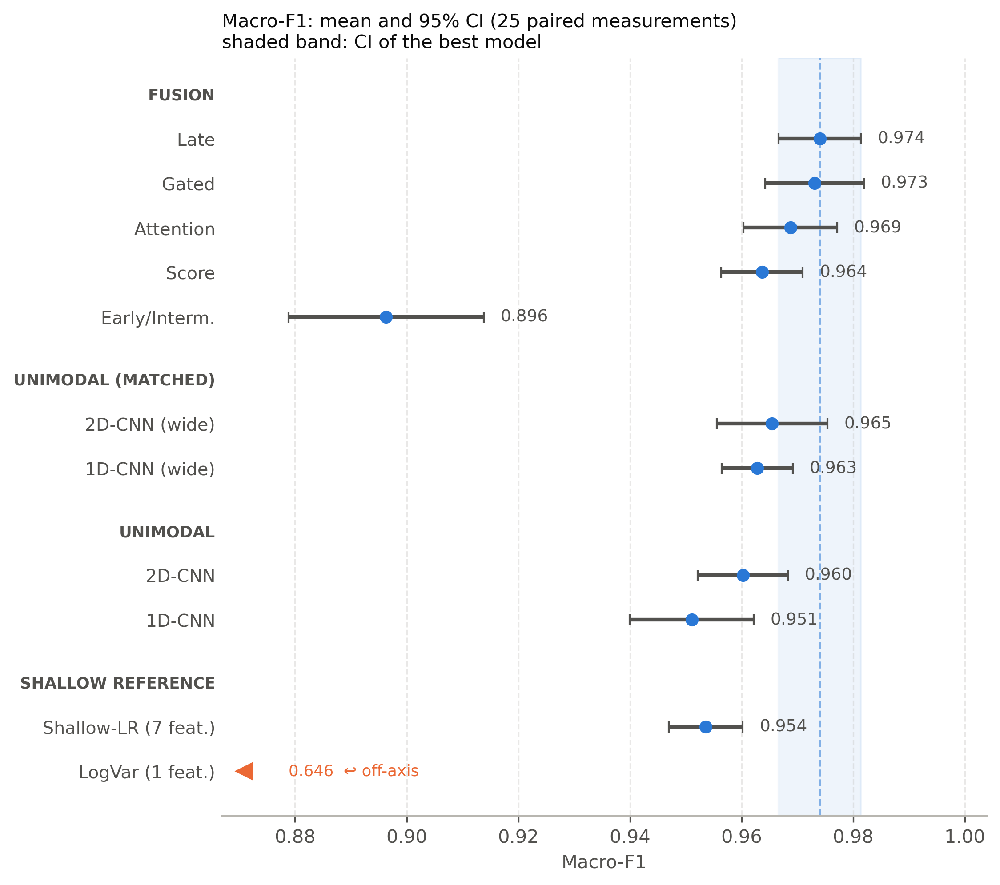
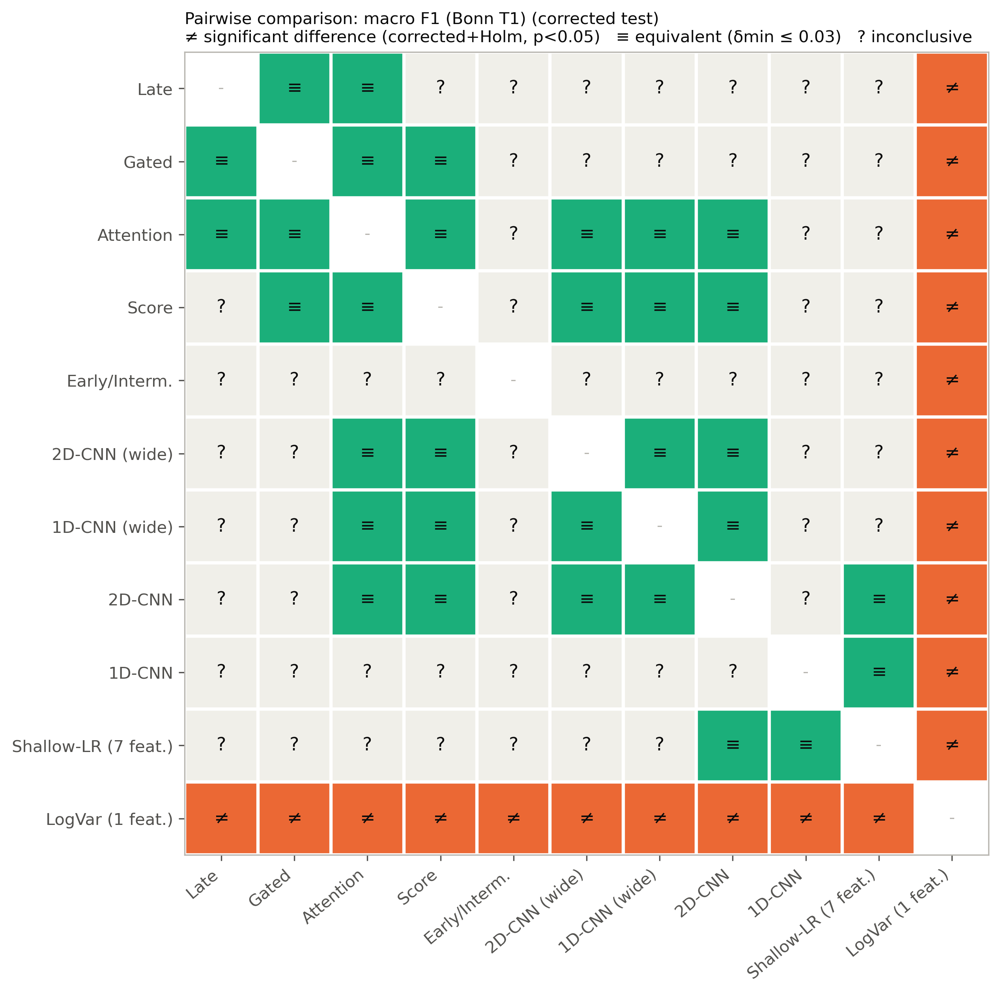
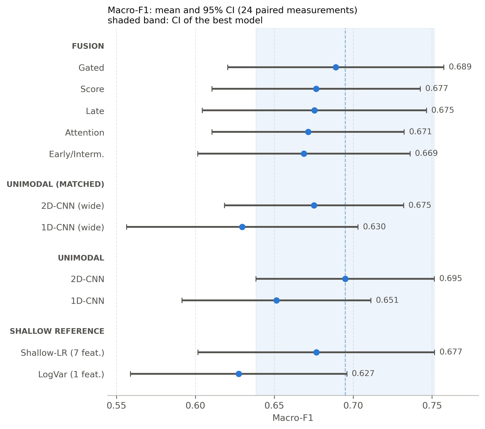
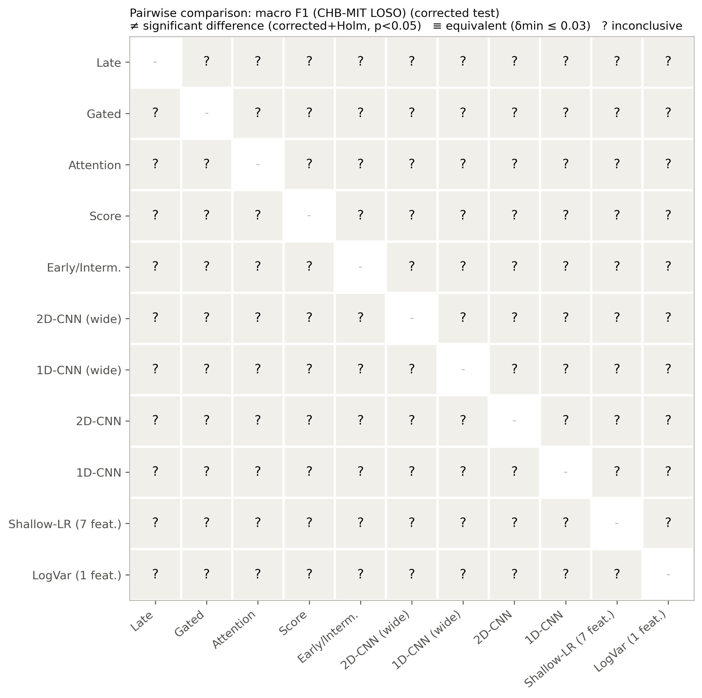

> **DRAFT, NOT FOR SUBMISSION.** This manuscript is a working draft. It has not been
> reviewed by an advisor, the systematic literature search committed to in
> `paper/proposal.md` has not been run, and the implementation is still the version
> described there as preliminary. Numbers are traceable to stored result files
> (paths given throughout) but the surrounding text, framing, and completeness are
> not final. See `docs/` for the full audit trail this draft is built from.

# Do Fusion Operators Matter? A Parameter-Matched, Statistically Controlled Comparison of Multimodal CNN Fusion for EEG Seizure Detection

Emre Atay Tümer
Computer Engineering and Industrial Engineering, Antalya Bilim University

## Abstract

Convolutional neural networks for EEG seizure detection commonly combine two
representations of the same signal, the raw waveform and its spectrogram, using a
fusion operator such as early, late, gated, attention, or score level fusion.
Published work routinely reports that a particular operator outperforms the
alternatives, but the compared models typically differ in more than the operator:
parameter count, training protocol, and evaluation design vary alongside it, and the
paired statistical tests used to support such claims commonly assume independent
measurements that repeated cross validation violates. We hold backbone architecture,
training protocol, and parameter budget fixed to within 1.3 percent and vary only the
fusion operator, then evaluate the resulting differences with a resampling corrected
paired test, Holm correction, and two one sided equivalence testing, on two corpora:
the Bonn EEG dataset (5x5 repeated stratified cross validation) and CHB-MIT (24
subject leave one subject out). On Bonn, no pair among late, gated, attention, and
score level fusion separates under the corrected test in any of three task
formulations, and the pairs are equivalent within an F1 margin of 0.02 to 0.03; early
fusion is the one operator that departs, and only downward. On CHB-MIT, none of the
same five operators separate either, but between subject variability is large enough
that equivalence itself cannot be established with confidence, a materially different
kind of negative result that we report separately from Bonn's. Two further findings
bear on evaluation practice generally. First, a simulation shows the naive paired
Wilcoxon test commonly used in this literature has a 38 percent false positive rate
under repeated cross validation; correcting for it collapses most of the differences
we originally observed. Second, CPU thread count alone, a setting with no bearing on
the scientific question, shifts per fold macro F1 by up to 0.09 on Bonn and 0.21 on
CHB-MIT, a magnitude comparable to or larger than the differences between the
operators under comparison. We also report and correct two errors we found along the
way: a training bug that let some models collapse to a trivial single class solution
while reporting high AUC, and a labelling error in CHB-MIT's own seizure annotations
that a sequence naive parser would turn into a nonexistent 6316 second seizure. We
argue that the absence of a detectable difference between fusion operators in this
literature is not yet established as a real finding so much as it is obscured by
evaluation practices too imprecise to resolve differences at this scale, and that
equivalence testing, corrected resampling statistics, and reporting of runtime
determinism should be standard rather than exceptional in this line of work.

## 1. Introduction

Electroencephalography (EEG) records the brain's electrical activity over time.
During an epileptic seizure this signal changes characteristically: amplitude rises,
the waveform becomes more rhythmic, and power concentrates in particular frequency
bands. Automatic seizure detection is therefore a signal classification problem, and
convolutional neural networks (CNNs) are the dominant modelling approach to it.

A recurring design pattern in this literature represents the same EEG segment two
ways at once: the raw waveform, processed by a 1D CNN, and its spectrogram, processed
by a 2D CNN. The two branches are combined by a fusion operator, most commonly one of
early fusion (combining inputs or early features), late fusion (combining final
feature vectors before classification), gated fusion (a learned per branch weight),
attention based fusion, or score level fusion (averaging the two branches' independent
predictions). Published comparisons of these operators typically report that the
authors' chosen operator wins. The comparisons, however, usually differ in more than
the operator under study: model capacity, training schedule, and data handling vary
alongside it. When a larger fusion model outperforms a smaller single branch model, it
is not clear whether the gain comes from the fusion mechanism or simply from the added
capacity.

This paper asks a narrower and more mechanical question than most work in this space:
when architecture size, training protocol, and data are held fixed, and only the
fusion operator is varied, does the operator choice produce a difference that survives
a statistical test appropriate to the way the data was resampled? We treat this as a
comparative and methodological study rather than a proposal for a new architecture,
and we hold ourselves to the same scrutiny we apply to the literature: every reported
number in this manuscript traces to a file under `results_v2/`, and every claim about
what has or has not been shown before is qualified by how the underlying literature
search was actually conducted (Section 2 and `docs/09`, `docs/14`).

### 1.1 Contributions

1. A parameter matched benchmark of five fusion operators plus single branch and
   classical feature controls, on the Bonn EEG corpus, under three task formulations,
   evaluated with 5x5 repeated stratified cross validation (Section 4).
2. An audit of the statistical practice common in this literature: a simulation
   quantifying the false positive rate of the naive paired test under repeated cross
   validation, and a corrected testing framework (resampled t test, Holm correction,
   equivalence testing, and a correlated Bayesian t test) applied throughout
   (Section 3.5).
3. External validation on CHB-MIT with subject wise leave one subject out evaluation,
   which the Bonn corpus does not support because it publishes no subject identifiers
   (Section 5), together with a disclosed exception to that subject wise design found
   during this work (Section 5.2).
4. Two methodological findings that generalise beyond this specific comparison: naive
   paired testing under repeated cross validation and CPU thread count as an
   unreported source of variance comparable in magnitude to the effect under study
   (Section 6).
5. A corrected, order based parser for CHB-MIT's seizure annotation files, after
   finding that the standard number based parsing is vulnerable to a labelling error
   present in the released files (Section 5.1).

## 2. Related Work

Table 1 summarises the closest published work to this comparison, restricted to what
we have verified through Crossref by DOI (see `paper/proposal.md` Section 3 and
`docs/09_LITERATUR_TARAMASI.md` for the underlying search; this is a scoping search,
not yet the registered systematic search committed to in the proposal and protocolled
in `docs/14_SISTEMATIK_TARAMA_PROTOKOLU.md`).

**Table 1. Closest related work.**

| Work | Contribution | What it leaves open |
|---|---|---|
| Andrzejak et al. (2001) | Introduces the Bonn EEG corpus | No per segment subject identifiers |
| Acharya et al. (2018) | Early deep CNN for Bonn seizure detection | Single architecture, no operator comparison |
| Truong et al. (2018) | CNN over spectrograms, scalp and intracranial | No raw signal branch to fuse against |
| Wang et al. (2020) | Compares 1D and 2D CNNs | Compared separately, not fused |
| Chatzichristos et al. (2020) | Attention gated multi view fusion | One operator, no alternatives compared |
| Das et al. (2024) | 1D+2D fusion of decomposed EEG | Fixed design, no operator ablation |
| Huang et al. (2024) | Multi head attention fusion | Reports gains without matching parameter count |
| Golrizkhatami and Acan (2018) | Three level fusion for ECG | Different signal domain, related fusion methodology |
| Narotamo et al. (2024) | Compares 1D and 2D representations plus early, late, and joint fusion, the same design question as ours | ECG, not EEG; no parameter matching or corrected/equivalence statistics |
| Roy (2019), Shoeibi (2021), Xu (2024) | Reviews of deep learning for EEG | Document inconsistent evaluation protocols, do not resolve them |
| Ali et al. (2024) | Shows CHB-MIT results depend heavily on evaluation choices | Concerns evaluation of CHB-MIT generally, not fusion operators |
| Rheude et al. (2025) | Multimodal complexity often does not pay off | General multimodal setting, not EEG |
| **Daşdemir (2025)** | **Self described fair, protocol controlled comparison of two fusion strategies for EEG** | Seizure *prediction*, not detection; two operators; reports a 0.20 point accuracy difference (97.50 vs 97.70) without a stated statistical test or parameter matching |
| Camastra et al. (2026), *Brain Sciences* | Controlled fusion benchmark, concludes strategy matters more than architecture | Tabular neuroimaging features, not EEG time series; no paired or equivalence testing |
| Mohamady et al. (2026) | Seven fusion techniques compared on one benchmark | Human activity recognition, not EEG; states this kind of head to head comparison did not previously exist in that field either |
| Kontras et al. (2026), NeuroAtlas | Reports Bonn is saturated (11 models at AUROC ≥ 0.99) and carries no subject identifiers | Foundation model benchmark, not a fusion operator comparison |

Reading this table, fusion operators for EEG seizure detection are proposed
frequently but are usually proposed and evaluated one at a time, against baselines
that differ in capacity from the proposed model. The closest work, Daşdemir (2025),
does hold two branches fixed and compares two fusion points, but on a prediction
rather than detection task, without a stated parameter matching procedure or
significance test on the 0.20 point difference it reports. We have not found a study
that compares three or more fusion operators for EEG seizure detection under a
matched parameter budget with paired statistical testing and equivalence testing. This
is the gap this paper addresses, stated at this narrower scope rather than as a
categorical absence, and subject to revision once the registered search (`docs/14`)
is complete. An independent review across the wider EEG-based multimodal
human-computer interface literature is consistent with this being a real gap rather
than a search artifact: Lee et al. (2025), surveying over 120 hybrid EEG studies,
report that only two explored more than one fusion strategy and only one directly
investigated which fusion approach was best, and name fusion strategy optimisation
as a direction the field has largely left open.

Two further points from Table 1 shape our design directly. First, NeuroAtlas reports
that Bonn's conventional binary split is saturated, eleven foundation models reaching
AUROC at or above 0.99, and recommends treating it as a sanity check rather than a
discriminating benchmark; this is not our own inference but an independent finding we
build on (Section 4.1, Section 6.3). Second, the same benchmark confirms Bonn
publishes no per segment subject identifier, which is why external validation with
genuine subject wise cross validation (Section 5) is necessary rather than optional
for any claim this paper makes about generalisation across patients.

## 3. Method

### 3.1 Architecture

Two branch CNN: a 1D convolutional encoder (channel widths 16, 32, 64) over the raw
waveform, and a 2D convolutional encoder of matching depth over the log magnitude
short time Fourier transform (STFT) spectrogram of the same segment. The two
encoders' pooled features (dimension 128 each) are combined by one of five
interchangeable fusion heads:

- **Early fusion.** The raw signal is passed through a small strided 1D encoder,
  broadcast across the spectrogram's time axis, and concatenated as an additional
  channel before the 2D backbone. We note for precision that this is what the
  literature calls "early" fusion but is, architecturally, an intermediate fusion:
  a genuinely input level combination of a 1D waveform and a 2D spectrogram is not
  well defined, since the two representations do not share a common tensor shape.
- **Late fusion.** The two branches' pooled feature vectors are concatenated and
  passed through a small MLP classifier head.
- **Gated fusion.** A learned scalar gate per branch reweights the concatenated
  features before classification.
- **Attention fusion.** A learned attention mechanism computes per branch weights
  from both feature vectors jointly.
- **Score level fusion.** The two branches are trained as independent unimodal
  classifiers; their softmax outputs are blended with a weight selected by grid
  search on the validation split only, never on test data (`src/train.py:
  best_blend_weight`).

Reference models: **raw1d** and **spec2d**, the same two backbones trained and
classified independently at their default width; **raw1d_wide** and **spec2d_wide**,
the same single branch models widened to match the fusion models' parameter count,
which is the correct comparison for asking whether fusion outperforms a unimodal
model rather than simply outperforming a smaller one; **logvar**, a one feature
logistic regression on the segment's log variance; and **shallow**, a logistic
regression on seven hand crafted features (log variance, line length, and relative
power in five frequency bands). The two classical baselines are not deep models and
are included to establish how much of any reported performance is attributable to
representation learning at all, rather than to the discriminability of the task
itself (`src/baselines.py`, `src/chbmit_baselines.py`).

### 3.2 Parameter matching

Every jointly trained variant (early, late, gated, attention, and the two widened
single branch controls) is sized to a common budget with a fusion head hidden
dimension solved numerically per operator (`src/models.py: _solve_hidden`) to land
within 1.3 percent of the target. On Bonn (single channel input) this budget is
approximately 98,500 parameters (late 98,571; gated 98,698; attention 98,544; early
97,507; spec2d_wide 97,775; raw1d_wide 99,795). Score level fusion, being an ensemble
of two independently sized unimodal models rather than a jointly parameterised head,
is reported at its own natural parameter count (59,302 on Bonn) rather than forced
into the same budget, since forcing it there would require shrinking its two
constituent classifiers below their own useful capacity. On CHB-MIT, the same budget
solved for 18 input channels lands between 102,236 and 103,712 parameters across the
same model set (Section 5.2), with a spread of 0.36 percent across the four jointly
trained fusion operators (late 102,768; gated 102,921; attention 102,767; early
102,547).

### 3.3 Preprocessing

Bonn's segments are band limited at acquisition to 0.53 to 40 Hz (Andrzejak et al.
2001); the spectrogram is computed with a 256 point STFT (window 256, hop 128) and
capped at the same 40 Hz. CHB-MIT is not band limited, and we measured (Section 5.1)
the largest ictal to interictal power ratio in the gamma band (30 to 70 Hz); the
frequency ceiling is therefore raised to 64 Hz for CHB-MIT rather than reused at 40 Hz
(`src/chbmit_prep.py`), and line noise removal at the US mains frequency (60 Hz) is
implemented as an optional, separately reported arm rather than baked into the
default pipeline, since it falls inside the informative gamma band.

Amplitude normalisation on Bonn is treated as an experimental factor with four arms
(N0 through N3, `src/config.py: NORM_MODES`) rather than a single fixed choice,
because an audit of the original implementation this project began from found the
cached spectrogram had in fact been computed from the unnormalised signal while the
1D branch saw a z scored signal, an inconsistency that biased comparisons involving
early fusion specifically (Section 6.4). The default arm used throughout (N2) z
scores both branches from the same normalised signal.

### 3.4 Training and evaluation protocol

Adam optimiser, learning rate 1e-3, weight decay 1e-4, batch size 32, class weighted
cross entropy loss. A minimum epoch budget of 20 is enforced before early stopping on
validation macro F1 (patience 12, ceiling 60 epochs); this guard was added after an
audit found 6 of 55 early runs had frozen in a trivial single class solution while
still reporting AUC near 0.96, because early stopping triggered while validation
macro F1 was flat rather than genuinely converged (Section 6.4). Seeds are
deterministic per (repeat, fold, model) via a hash of those three values
(`src/config.py: fold_seed`), removing a dependency on execution order that the
original implementation had.

On Bonn, evaluation is 5x5 repeated stratified cross validation (25 paired
measurements per model) with an inner 20 percent validation split carved from the
training fold, never touching the test fold. On CHB-MIT, evaluation is 24 fold leave
one subject out, with the same inner validation split constructed subject wise
(Section 5.3), since Bonn's lack of subject identifiers makes this comparison
impossible there.

### 3.5 Statistical framework

Repeated cross validation measurements are not independent: the folds share
training data across repeats, which the standard paired test (independent samples,
or naive paired Wilcoxon or t test) does not model. We quantified the consequence by
simulation (`src/sim_cv_correlation.py`): two statistically identical logistic
regression classifiers, differing only in which of two equally informative feature
sets they see, evaluated by 5x5 repeated cross validation over 1000 simulated
datasets. Naive Wilcoxon rejected the (true) null of no difference in 37.6 percent
of simulations, and a naive paired t test in 38.6 percent, against a nominal 5
percent. A resampling corrected t test (following Nadeau and Bengio 2003 and
Bouckaert and Frank 2004, which inflate the standard error by the fraction of data
shared between the resampled training sets) rejected in 2.3 percent of simulations,
close to nominal. This matches an independent, external result: Jafrasteh et al.
(2025), studying neuroimaging classifiers rather than EEG fusion specifically, show
by a different route that whether a cross validated comparison comes out
significant depends on the number of folds and repeats chosen, which is exactly the
dependence structure that makes p-hacking possible under the naive test.

All significance claims in this paper therefore use the corrected test
(`src/stats.py: corrected_ttest`), with Holm correction across all pairwise
comparisons within a task and metric. Where a null result is claimed, we support it
with a two one sided equivalence test computed with the same corrected variance
(`corrected_equivalence_bound`, reporting the minimum margin δmin at which
equivalence would be established at α = 0.05), a correlated Bayesian t test
(following Corani and Benavoli 2015; Corani, Benavoli, Demšar, and Mangili 2017)
reporting the posterior probability of practical equivalence within a stated region
of practical equivalence (ROPE), and a sign test as a distribution free check. We
report primary results on macro F1 and Brier score; log loss is reported but treated
as secondary, because it proved heavy tailed and unstable across both corpora
(Section 4.3, Section 5.2), inflating variance for any model with even a few
confidently wrong predictions and correspondingly losing statistical power.

## 4. Bonn Results

### 4.1 Task formulations

The Bonn corpus (Andrzejak et al. 2001) comprises five sets of 100 single channel
segments each (23.6 s, 4097 samples, 173.61 Hz): A and B are surface (scalp)
recordings from healthy volunteers, C, D, and E are intracranial depth electrode
recordings from epilepsy patients, with E capturing ictal activity. We evaluate three
label groupings: **T1**, a three class task (Normal = A,B; Interictal = C,D; Ictal =
E); **T2**, an intracranial only binary task (C,D vs E) that removes the scalp versus
intracranial recording type as a confound; and **T3**, the conventional binary split
used in most published work (A,B,C,D vs E). We retain T3 as a reference point rather
than a headline result, because a single feature logistic regression (`logvar`)
reaches 0.954 macro F1 on it against 0.986 for the best of eleven models (Table 2),
independently consistent with NeuroAtlas's report that this split saturates.

### 4.2 Main results

**Table 2. Bonn, macro F1 and AUC, mean over 25 paired measurements (5x5 repeated
stratified CV).** Source: `results_v2/T{1,2,3}_*_N2_z_zspec_*/perfold.csv`.

| Model | T1 F1 | T1 AUC | T2 F1 | T2 AUC | T3 F1 | T3 AUC | Params |
|---|---|---|---|---|---|---|---|
| late | 0.974 | 0.999 | 0.987 | 1.000 | 0.986 | 1.000 | 98,571 |
| gated | 0.973 | 0.999 | 0.987 | 0.999 | 0.980 | 1.000 | 98,698 |
| attention | 0.969 | 0.997 | 0.985 | 0.999 | 0.977 | 0.998 | 98,544 |
| spec2d_wide | 0.966 | 0.998 | 0.984 | 0.999 | 0.982 | 1.000 | 97,775 |
| score | 0.964 | 0.998 | 0.981 | 0.999 | 0.976 | 0.999 | 59,302 |
| raw1d_wide | 0.963 | 0.997 | 0.973 | 0.998 | 0.976 | 0.992 | 99,795 |
| spec2d | 0.960 | 0.998 | 0.979 | 0.999 | 0.972 | 0.999 | 32,227 |
| shallow | 0.954 | 0.996 | 0.964 | 0.995 | 0.964 | 0.995 | 8 |
| raw1d | 0.951 | 0.996 | 0.964 | 0.997 | 0.969 | 0.995 | 27,075 |
| early | **0.896** | 0.977 | **0.923** | 0.981 | **0.899** | 0.965 | 97,507 |
| logvar | 0.646 | 0.755 | 0.933 | 0.986 | 0.954 | 0.992 | 1 |

**Figure 1.** Bonn T1, mean macro F1 with 95% CI per model, grouped by family.
Early/intermediate fusion (bold, Table 2) is the one operator visibly separated
from the fusion cluster; logvar sits far off axis and is shown pinned to the left
edge with its value labelled, rather than compressing the rest of the plot.

Two patterns hold across all three tasks. First, **early fusion is the one operator
that separates from the rest, and only downward** (bold in Table 2). Second, on T2
and T3, **naive Wilcoxon finds 20 and 13 "significant" pairs respectively out of 55,
and the corrected test finds zero on both** (`results_v2/phase0/summary.csv`); on T1,
naive finds 22 and corrected finds 10, all ten involving `logvar`, none involving a
pairwise comparison among the deep models (Section 4.3). We treat this collapse from
naive to corrected significance as itself a central finding, not a footnote (Section
6.1).

**Figure 2.** Bonn T1, all 11 models, pairwise outcome of the corrected test at
delta_min <= 0.03 macro F1. Green cells (late, gated, attention, score, and
the two widened unimodal controls) are established equivalent to each other; orange
cells are `logvar` against everything else, the only pairs that reach corrected
significance in this dataset. Grey cells, including every comparison involving early
fusion, are inconclusive at this margin and sample size, not equivalent and not
significantly different. Note that this figure sources the same 2-thread numerical
realisation as Table 2 (Section 6.2); the one significant early-vs-late pair reported
in Section 4.3 comes from a separate 12-thread realisation and does not appear here,
itself a small illustration of the thread count finding.

### 4.3 Are the fusion operators distinguishable from each other?

Restricting to the five fusion operators (early, late, gated, attention, score) and
their ten pairwise comparisons on T1, using the numerical realisation with recorded
log loss and Brier (Section 6.2 explains why two realisations exist), the corrected
test finds **one significant pair on macro F1** (early vs late, p_Holm = 0.048)
and **three on Brier** (early vs gated, early vs late, early vs score, all
p_Holm < 0.04); log loss finds none, consistent with its instability
(Section 3.5). Every other pair among late, gated, attention, and score is
statistically indistinguishable under the corrected test, with equivalence margins
δmin between 0.022 and 0.028 macro F1, and Bayesian posterior probability
of equivalence within a ±0.01 ROPE between 0.48 and 0.61 for these pairs, against
0.001 to 0.005 for pairs involving early. In short: **late, gated, attention, and
score are equivalent to each other within about 0.02 to 0.03 macro F1; early is not
equivalent to any of them, and is worse.**

### 4.4 Robustness of the null result

Repeating the T1 comparison at three spectrogram resolutions and three fusion
parameter budgets (`results_v2/phase0/sens_*`) leaves the conclusion intact at five
of six design points (9 of 45 pairs significant at each, all `logvar` related as in
Section 4.2); the one partial exception is that score level fusion, the one operator
that does not train its two branches jointly, degrades when one branch is
deliberately weakened, which is the expected behaviour of an operator that cannot
compensate for an underperforming branch during training.

The amplitude normalisation ablation (N1: spectrogram computed from the
unnormalised signal, against N2: both branches normalised) shows early fusion shifts
by 0.062 macro F1 between the two arms (naive p < 1e-6; corrected
p_Holm = 0.067, borderline after correction) while every other model is
statistically untouched (`results_v2/phase0/ablation_N1_vs_N2.csv`). This localises
an amplitude related shortcut to exactly the one architecture that concatenates the
raw signal into the spectrogram's channel dimension (Section 3.1), and is a plausible
mechanistic explanation for why early fusion is the one operator that separates.

## 5. CHB-MIT: External Validation

Bonn publishes no per segment subject identifier, so no claim in Section 4 bears on
whether a model generalises across patients rather than across segments drawn from a
small, possibly overlapping pool. CHB-MIT (Shoeb 2009; Goldberger et al. 2000),
publicly available via PhysioNet, provides 24 pediatric recording cases with subject
identifiers, making leave one subject out (LOSO) evaluation possible for the first
time in this comparison, with one documented exception to "24 cases means 24
distinct subjects" that we did not control for (Section 5.2).

### 5.1 Data preparation and two errors found in the source data

We downloaded and verified the full corpus (686 recordings, 982.9 hours,
`src/verify_chbmit.py`), confirming file integrity against sizes computed from each
EDF header rather than trusting file listings.

**Annotation labelling error.** Summing seizure counts from each subject's summary
file gives 198 seizures, matching PhysioNet's published count, but the naive
approach of pairing "Seizure N Start/End Time" lines by their printed number produces
a total ictal duration of 17,856 seconds. One file, `chb09_08.edf`, contains a
labelling error in the source data: its second seizure's end line is itself printed
as "Seizure 1 End Time" rather than "Seizure 2", so a number based parser pairs the
first seizure's start (2951 s) with the second seizure's end (9267 s), fabricating a
6316 second seizure that does not exist. We replaced number based pairing with
sequence based pairing (each "Start Time" opens a seizure, each "End Time" closes the
most recently opened one, and the parsed count is cross checked against each file's
declared "Number of Seizures") and this corrects total ictal duration to 11,611
seconds, a 35 percent reduction, with every subject's parsed count now matching its
declaration (`src/chbmit.py: parse_summary`).

**Index file error.** PhysioNet's `RECORDS-WITH-SEIZURES` index lists
`chb07/chb07_18.edf` as containing a seizure, but that file's own summary declares
zero seizures and no `.seizures` annotation file exists for it on the server (HTTP
404); `chb07_19.edf` has both a declared seizure and a server side annotation file.
Both independent sources agree the index file names the wrong recording for this one
entry.

**Channel montage.** Channel sets vary not only between subjects but between
recordings of the same subject: part of subject 12's recordings use a different
reference montage (channels such as `C3-CS2`) that shares no channel with the
standard bipolar montage used elsewhere, so a naive intersection across all
recordings returns zero channels. We fix the standard 18 channel bipolar montage as
a target and drop recordings that do not contain it, retaining 683 of 686 recordings
and 185 of 198 seizures; the three dropped recordings and 13 dropped seizures are
entirely from the affected part of subject 12's data.

### 5.2 Windowing, class balance, and leakage control

Ten second, non overlapping windows. Non overlapping windows are an explicit choice:
overlapping, sub window strided windowing (which we considered to increase the
positive count) risks placing near identical copies of the same seizure on both
sides of a train or test split, an error documented in this literature (Ali et al.
2024). A window is labelled ictal if it overlaps an annotated seizure interval at
all, so a window that only partly covers a seizure's onset or offset is labelled
ictal. Of the 1,276 ictal windows, 948 lie entirely within a seizure and 328 (25.7
percent) are such boundary windows, containing a median of 5.0 seconds of annotated
seizure (minimum 1.0 second). The alternative, excluding boundary windows, is
implemented (`src/chbmit.py: plan_windows`, `guard_s`) but has not been run, and is
listed among the CHB-MIT sensitivity analyses still outstanding (Section 7).
Because ictal windows are 0.34 percent of all windows before subsampling, non
ictal windows are subsampled per subject to a 4:1 ratio against that subject's own
ictal count, and both this ratio and each subject's true unsampled recording duration
are retained so that clinically meaningful rates (false alarms per hour) can in
principle be computed on the true time base rather than the subsampled one (a
computation we have not yet performed; Section 7).

Two leakage rules are enforced and checked: no subject's windows may appear in both
train and test, and no single seizure's windows may be split across train and test.
We validated the leakage checker itself by constructing a deliberately leaky split
(windows shuffled at random, ignoring subject and seizure identity) and confirming it
is flagged on both rules; the real LOSO and grouped k-fold splits used throughout are
confirmed leakage free by the same checker (`src/chbmit_corpus.py`), under the
subject grouping described next.

**A documented exception we did not control for.** Our subject grouping is derived
from CHB-MIT's case folder names (chb01 through chb24), which is what both rules
above check against. PhysioNet's own dataset documentation states that "case chb21
was obtained 1.5 years after case chb01, from the same female subject," and that
case chb24 was added later and is not listed in the corpus's `SUBJECT-INFO` file. The
24 case folders therefore correspond to at most 23, and in this one documented
instance at least 22, distinct individuals rather than 24. Because our grouping
treats chb01 and chb21 as different subjects, the LOSO fold that holds out chb01
trains on chb21's windows from the same person, and vice versa. The effect is
visible and asymmetric: on the chb01 fold, every model's macro F1 is far above its
own 24 fold mean (late fusion reaches 0.981 against a mean of 0.675; gated reaches
0.962 against 0.689), while the chb21 fold is among the worst for most models (late
fusion 0.444). Excluding the chb01 fold alone lowers every model's mean macro F1 by
0.006 to 0.013 (spec2d_wide is the one exception, which rises by 0.002) and leaves
the Table 3 ranking largely intact (Spearman rho = 0.88, p < 0.001, between the full
and chb01 excluded rankings). We did not re run LOSO with chb01 and chb21 merged
into a single held out subject before writing this manuscript, so Table 3, Section
5.3, and the CHB-MIT statistics in Section 6 all still reflect the uncorrected
grouping; we disclose this as a limitation (Section 7) rather than silently correct
it, because a partial re run would leave figures and prose inconsistent with each
other. Given the small aggregate effect and unchanged ranking, we do not believe this
changes the paper's central finding, but it should be fixed before any of these
CHB-MIT numbers are treated as final.

The resulting corpus is 6,380 windows (1,276 ictal) across 24 subjects and 18
channels. Model architectures are unchanged from Section 3.1 except that the first
convolutional layer of each backbone accepts 18 input channels rather than one; this
adds channels only to the input layer and leaves every reported Bonn parameter count
identical when re run at 1 input channel, which we verified directly rather than
assuming.

### 5.3 Results

**Table 3. CHB-MIT, macro F1, log loss, and Brier, mean over 24 leave one subject
out folds.** Source: `results_v2/chbmit/loso_main/perfold.csv`.

| Model | F1 | F1 SD | Log loss | Brier |
|---|---|---|---|---|
| spec2d | 0.695 | 0.134 | 0.820 | 0.283 |
| gated | 0.689 | 0.162 | 0.655 | **0.260** |
| shallow | 0.677 | 0.178 | 0.620 | 0.365 |
| score | 0.677 | 0.156 | **0.501** | 0.260 |
| late | 0.675 | 0.168 | 0.936 | 0.314 |
| spec2d_wide | 0.675 | 0.134 | 0.861 | 0.291 |
| attention | 0.672 | 0.144 | 0.849 | 0.289 |
| early | 0.669 | 0.159 | 1.031 | 0.336 |
| raw1d | 0.651 | 0.142 | 0.805 | 0.312 |
| raw1d_wide | 0.630 | 0.174 | 0.869 | 0.335 |
| logvar | 0.627 | 0.162 | 0.609 | 0.411 |

**Figure 3.** CHB-MIT LOSO, mean macro F1 with 95% CI per model, same axis
conventions as Figure 1. Compare the width of these intervals to Figure 1's: every
model's 95% CI here spans roughly 0.15 to 0.2 macro F1, wide enough that all eleven
overlap substantially, which is the between subject variability problem stated in
prose below made visible.

**No pair among the five fusion operators separates under the corrected test on any
metric** (0 of 10 pairs on macro F1, log loss, or Brier;
`results_v2/chbmit/phase0/chbmit_*.csv`), and in fact **no pair among all 55
comparisons across all 11 models separates, even under the uncorrected naive test**
on macro F1 (0 of 55). This is a stronger non separation than Bonn's, where the naive
test found 22 of 55 pairs "significant" before correction. The reason is visible in
the standard deviation column of Table 3: between subject variability (SD 0.13 to
0.18 in macro F1) is large relative to the mean differences between models
(spread across all 11 models of 0.068), so no resampling based test, corrected or
not, has the power to resolve differences at this scale from 24 subjects.

This is not the same finding as Bonn's, and we report it separately rather than
folding both into one sentence about operators being "indistinguishable". On Bonn,
equivalence is positively established: the Bayesian posterior probability that late,
gated, attention, and score are practically equivalent (within a ±0.01 macro F1
ROPE) reaches as high as 0.61 for some pairs. On CHB-MIT, the same posterior
probability for the same five operators' ten pairs ranges only 0.18 to 0.26, and the
corrected equivalence margin δmin ranges 0.055 to 0.082, wider than any
Bonn pair. **CHB-MIT does not show that the operators are equivalent; it shows only
that this design, at 24 subjects, cannot resolve whether they are equivalent or
different.** This is a materially weaker and more honest claim, and the distinction
matters for anyone citing this result: "we could not tell the difference" is not
"there is no difference."

**Figure 4.** CHB-MIT LOSO, all 11 models, the same corrected test and the same
delta_min <= 0.03 margin as Figure 2. Every cell is inconclusive. Contrasted directly
with Figure 2, which is mostly green (equivalent) with a clear orange block
(`logvar` significantly worse), this is the clearest single illustration in this
paper of the difference between "no difference found" and "equivalence established":
identical method, identical margin, and CHB-MIT's between subject variance is enough
to erase every distinction Bonn's design could draw, including the one, `logvar`
being worse, that Bonn establishes most strongly of all.

A further consequence is that **early fusion's Bonn specific weakness does not
replicate on CHB-MIT**: it ranks eighth of eleven models by macro F1, not last, and
the worst performing model is instead `raw1d_wide`, a unimodal capacity matched
control. We cannot distinguish, with the present data, whether early fusion's Bonn
result reflects something genuine about that architecture or reflects a Bonn specific
artefact (Section 4.4's amplitude shortcut finding is itself Bonn specific, since it
concerns the interaction between early fusion and a spectrogram caching bug in the
Bonn pipeline the current implementation does not share).

**Classical features remain competitive.** The `shallow` classical baseline (a
logistic regression on seven hand engineered features per channel) ranks third of
eleven models by macro F1, 0.018 behind the best model, and outperforms two of the
five fusion operators and both capacity matched unimodal controls. This is a less
extreme version of Bonn's saturation finding (Section 4.1) but the same direction:
the representation learning component of these models is not obviously earning its
keep over a linear classifier on hand engineered features, on either corpus.

**Score level fusion is best calibrated, not necessarily most accurate.** Score
fusion, the simplest of the five operators, an ensemble of two independently trained
unimodal models with no additional training, achieves the lowest log loss of all
eleven models (0.501, next best 0.609) and is statistically tied for lowest Brier
score with gated fusion (0.260 vs 0.260). Its macro F1 (0.677) is unremarkable and not
separable from the other operators. We flag this as an interesting but narrow
finding: classification accuracy and probabilistic calibration are different
properties, and an operator that wins on one need not win on the other. This has a
plausible theoretical explanation rather than being an accident of this dataset:
Mattei and Garreau (2025) show that averaging predictions from an ensemble of
models is guaranteed to help a convex loss, by Jensen's inequality, but carries no
such guarantee for a non convex one. Log loss and Brier score are convex, macro F1
is not, which is consistent with score fusion (the one operator here that is a
literal post hoc average of two independent models) improving on the two convex
metrics without improving on the non convex one.

## 6. Discussion: What Does "Cannot Distinguish" Mean Here

### 6.1 The naive test is not a minor technicality

Across both corpora, the gap between naive and corrected significance is the single
largest effect size in this paper. On Bonn T2 and T3, naive testing reports 20 and 13
"significant" differences respectively that the corrected test reduces to zero. Our
simulation (Section 3.5) shows this is expected: the naive test's false positive rate
under repeated cross validation is 37 to 39 percent against a nominal 5 percent, an
error rate large enough that a substantial fraction of "significant" findings
reported under this common practice, in this literature and adjacent ones, should be
presumed spurious until shown otherwise by a corrected re-analysis. We are not aware
of prior work in the EEG seizure detection literature specifically that quantifies
this by simulation, though the underlying statistical point (Nadeau and Bengio 2003;
Bouckaert and Frank 2004) predates this application by two decades.

### 6.2 Thread count as an unreported confound

While verifying determinism of the CHB-MIT pipeline we found that CPU thread count
alone, set via `torch.set_num_threads` and otherwise invisible in any results table,
shifts per fold macro F1 by up to 0.093 on Bonn and 0.208 on CHB-MIT (a single
outlier fold; median effect near zero, mean effect 0.05 across the 24 fold by 2 model
comparisons we made), holding code, data, and random seed fixed
(`docs/10_OLASILIK_VE_TEKRARLANABILIRLIK.md`, `docs/13_CHBMIT_ISTATISTIK.md`). We
confirmed this is deterministic at fixed thread count (three repeated runs at
identical settings reproduce identical results to the last recorded decimal) and
that the effect appears only when thread count changes, which localises the cause to
floating point summation order in multi threaded BLAS and convolution routines
rather than to any nondeterministic scheduling. The consequence for interpretation is
direct: on Bonn, the spread across our five fusion operators (0.078 macro F1, Table
2) is comparable to the spread this single, scientifically meaningless setting can
introduce on its own (0.093, measured on a separate numerical realisation of the same
comparison); on CHB-MIT the thread effect can exceed the entire operator spread
(0.068). Thread count, batch order and library version are not
routinely reported in this literature; our finding suggests they should be, and that
result tables from single, unreported hardware configurations warrant more caution
than they are usually given.

### 6.3 Two corpora, two different reasons for a null result

We deliberately avoid summarising Bonn and CHB-MIT with the same sentence. Bonn's
task, particularly its conventional binary split, is saturated (Section 4.1;
independently confirmed by Kontras et al. 2026), and within that regime the five
fusion operators are shown, positively, to be statistically equivalent to each other
at a fairly tight margin. CHB-MIT is not saturated in the same way (macro F1 in the
0.63 to 0.70 range, well below ceiling) but its between subject variability is large
enough that with 24 subjects, this design has too little power to establish either
equivalence or difference between the operators. Both are negative results for the
practical question "does the fusion operator matter", but they are negative for
different statistical reasons, and a reader who only takes away "no difference was
found" has lost the more useful, more falsifiable content of each result.

### 6.4 Defects found and corrected in this project's own history

Consistent with the standard we apply to the published literature, we report the
defects found during this project's own development rather than omitting them.

| Defect | How it was found | Consequence |
|---|---|---|
| Spectrogram cache built from the unnormalised signal | Cached values matched the unnormalised spectrogram to numerical precision | Confounded early fusion's operator effect with an amplitude shortcut (Section 4.4) |
| Early stopping froze 6 of 55 runs in a trivial single class solution | F1 near 0.40 co-occurring with AUC near 0.96 | Fixed with a minimum epoch floor; affected runs recovered to 0.96 to 1.00 |
| Naive paired testing under repeated cross validation | Simulation (Section 3.5) | Most originally reported "significant" differences did not survive correction |
| CHB-MIT annotation number based parsing | A 27 minute average seizure duration in one subject was not physiologically plausible | Total ictal duration corrected downward by 35 percent (Section 5.1) |
| CPU thread count changes results | Direct controlled test after an unusual wall clock slowdown was investigated | Documented as a confound (Section 6.2), not fully eliminated |

## 7. Limitations

- **CHB-MIT's LOSO folds were not corrected for one documented same subject pair**
  (chb01 and chb21, per PhysioNet's own dataset documentation; Section 5.2). The
  measured effect on aggregate results is small (0.006 to 0.013 macro F1 per model)
  and the model ranking is largely preserved (Spearman rho = 0.88), but the
  corrected LOSO grouping (merging chb01 and chb21 into one held out subject) has
  not yet been run, and Table 3 and Section 6's CHB-MIT statistics should be
  re-derived from it before this work is treated as final.
- **The corrected resampled t test assumes a fixed test to train ratio, which an
  inner validation split complicates.** Del Pup et al. (2025) argue this assumption
  is frequently violated in deep learning pipelines that hold out an internal
  validation set, as ours does for early stopping (Section 3.4). Our primary analysis
  uses the standard ratio 1/(k-1) (0.25 for Bonn, 1/23 for CHB-MIT LOSO). As a
  sensitivity check we recomputed every test with a conservative ratio based on the
  data actually used for fitting once the validation split is removed (0.3125 for
  Bonn; 1/18 for CHB-MIT, where five of the 23 training subjects are held out for
  validation). No conclusion changes: the number of Holm significant pairs is
  identical in all four analyses (10 of 55 on Bonn T1; 0 of 55 on Bonn T2, Bonn T3,
  and CHB-MIT), and the corrected equivalence bounds for the fusion operator pairs
  widen by at most 0.005 macro F1 (`src/phase0.py`, `src/chbmit_stats.py`, column
  `p_corrected_conservative`). This addresses the objection empirically for our
  design; it does not replace a correction derived for nested splits.
- **The literature gap claimed in Section 2 rests on a scoping search, not yet the
  registered systematic search** described in `paper/proposal.md` and protocolled in
  `docs/14_SISTEMATIK_TARAMA_PROTOKOLU.md`. The closest work, Daşdemir (2025), has
  been read only at the abstract level; its full text may show it already
  addresses part of the gap claimed here.
- **CHB-MIT's clinically relevant false alarm rate has not been computed on the true,
  unsubsampled time base**; the subsampled rate we could report would not be
  clinically meaningful and we have chosen not to report it rather than report a
  number likely to be misread (Section 5.2).
- **No sensitivity analysis has been run on CHB-MIT** corresponding to Section 4.4's
  Bonn analysis (window length, frequency ceiling, line noise removal, subsampling
  ratio, and whether the 25.7 percent of ictal windows that only partly overlap a
  seizure are kept; Section 5.2); the CHB-MIT results in Section 5.3 should be read
  as a single design point.
- **Hardware is CPU only**, which bounds both the scale of models we could evaluate
  and, per Section 6.2, appears to bound the numerical reproducibility of the results
  themselves.
- **The current implementation is treated by its own authors as preliminary.** The
  proposal this project is attached to states an intention to rebuild the pipeline
  cleanly under advisor supervision before treating any of these numbers as final;
  this manuscript should be read as reporting what that preliminary implementation
  currently shows, not as a final account.

## 8. Use of AI Assistance

An AI assistant (Claude) was used substantially in this work: implementation of the
data pipeline, model code, and statistical framework; execution of the experiments
reported here; drafting of this manuscript; and verification of the reference list
against Crossref. The choice of topic, dataset, and research question, the original
implementation that was later audited, and the decision at each branch point in the
analysis (including which design choices to treat as ablations, and which findings
to report as limitations rather than omit) were made by the author, who takes
responsibility for understanding and being able to defend every part of this work.

## 9. Data and Code Availability

All code, the per fold results underlying every number in this manuscript, and the
analysis and figure generation scripts are publicly available at
github.com/Atytmr07/eeg-fusion-benchmark. `docs/PIPELINE.md` in that repository
documents the full pipeline and the command that reproduces each table and figure;
the statistics and figures regenerate identically from the stored results with the
pinned package versions. Raw EEG data (Bonn, CHB-MIT) is not redistributed; both
corpora are publicly available from their original sources (Andrzejak et al. 2001;
PhysioNet), and the repository documents how to obtain and verify them
(`src/chbmit.py`, `src/verify_chbmit.py`, `docs/11_CHBMIT_PLANI.md`).

## References

- Ali, E. et al. (2024) Epileptic seizure detection using CHB-MIT dataset: The overlooked perspectives. *Royal Society Open Science* 11(5):230601. doi:10.1098/rsos.230601
- Acharya, U. R. et al. (2018) Deep convolutional neural network for the automated detection and diagnosis of seizure using EEG signals. *Computers in Biology and Medicine* 100:270-278. doi:10.1016/j.compbiomed.2017.09.017
- Andrzejak, R. G. et al. (2001) Indications of nonlinear deterministic and finite-dimensional structures in time series of brain electrical activity. *Physical Review E* 64(6):061907. doi:10.1103/PhysRevE.64.061907
- Camastra, C., Pelagi, A., Quattrone, A., Sarica, A. (2026) Benchmarking Multimodal Deep Fusion Strategies for Heterogeneous Neuroimaging and Cognitive Data Using a Controlled Sex Classification Task. *Brain Sciences* 16(4):405. doi:10.3390/brainsci16040405
- Bouckaert, R. R., Frank, E. (2004) Evaluating the Replicability of Significance Tests for Comparing Learning Algorithms. *Lecture Notes in Computer Science* (PAKDD 2004). doi:10.1007/978-3-540-24775-3_3
- Chatzichristos, C. et al. (2020) Epileptic Seizure Detection in EEG via Fusion of Multi-View Attention-Gated U-Net Deep Neural Networks. *IEEE SPMB*. doi:10.1109/spmb50085.2020.9353630
- Corani, G., Benavoli, A. (2015) A Bayesian approach for comparing cross-validated algorithms on multiple data sets. *Machine Learning* 100:285-304. doi:10.1007/s10994-015-5486-z
- Corani, G., Benavoli, A., Demšar, J., Mangili, F. (2017) Statistical comparison of classifiers through Bayesian hierarchical modelling. *Machine Learning* 106:1817-1837. doi:10.1007/s10994-017-5641-9
- Daşdemir, A. (2025) Epileptic seizure prediction with deep learning-based fusion methods. *Engineering Science and Technology, an International Journal* 72:102212. doi:10.1016/j.jestch.2025.102212
- Das, S. et al. (2024) Epileptic Seizure Detection from Decomposed EEG Signal through 1D and 2D Feature Representation and Convolutional Neural Network. *Information* 15(5):256. doi:10.3390/info15050256
- Del Pup, F., Zanola, A., Tshimanga, L. F., Bertoldo, A., Atzori, M. (2025) The More, the Better? Evaluating the Role of EEG Preprocessing for Deep Learning Applications. *IEEE Transactions on Neural Systems and Rehabilitation Engineering* 33:1061-1070. doi:10.1109/TNSRE.2025.3547616
- Goldberger, A. L. et al. (2000) PhysioBank, PhysioToolkit, and PhysioNet: Components of a New Research Resource for Complex Physiologic Signals. *Circulation* 101(23):e215-e220. doi:10.1161/01.cir.101.23.e215
- Golrizkhatami, Z., Acan, A. (2018) ECG classification using three-level fusion of different feature descriptors. *Expert Systems with Applications* 114:54-64.
- Jafrasteh, B., Adeli, E., Pohl, K. M., Kuceyeski, A., Sabuncu, M. R., Zhao, Q. (2025) Statistical variability in comparing accuracy of neuroimaging based classification models via cross validation. *Scientific Reports* 15:28745. doi:10.1038/s41598-025-12026-2
- Huang, J. et al. (2024) Multi-modal feature fusion with multi-head self-attention for epileptic EEG signals. *Mathematical Biosciences and Engineering* 21(2). doi:10.3934/mbe.2024304
- Kontras, K. et al. (2026) NeuroAtlas: Benchmarking Foundation Models for Clinical EEG and Brain-Computer Interfaces. arXiv:2605.14698.
- Lee, H.-T., Shim, M., Liu, X., Cheon, H.-R., Kim, S.-G., Han, C.-H., Hwang, H.-J. (2025) A review of hybrid EEG-based multimodal human-computer interfaces using deep learning: applications, advances, and challenges. *Biomedical Engineering Letters* 15:587-618. doi:10.1007/s13534-025-00469-5
- Mattei, P.-A., Garreau, D. (2025) Are Ensembles Getting Better all the Time? *Journal of Machine Learning Research* 26(201):1-46. arXiv:2311.17885.
- Mohamady, A., Burchard, R., Van Laerhoven, K. (2026) A Comparison of Fusion Techniques for Multi-Modal Human Activity Recognition on the HARMES Dataset. arXiv:2606.27886.
- Nadeau, C., Bengio, Y. (2003) Inference for the Generalization Error. *Machine Learning* 52:239-281. doi:10.1023/a:1024068626366
- Narotamo, H., Dias, M., Santos, R., Carreiro, A. V., Gamboa, H., Silveira, M. (2024) Deep learning for ECG classification: A comparative study of 1D and 2D representations and multimodal fusion approaches. *Biomedical Signal Processing and Control* 93:106141. doi:10.1016/j.bspc.2024.106141
- Rheude, T., Eils, R., Wild, B. (2025) Fusion or Confusion? Multimodal Complexity Is Not All You Need. arXiv:2512.22991.
- Roy, Y. et al. (2019) Deep learning-based electroencephalography analysis: a systematic review. *Journal of Neural Engineering* 16:051001. doi:10.1088/1741-2552/ab260c
- Shoeb, A. H. (2009) Application of machine learning to epileptic seizure onset detection and treatment. PhD thesis, Massachusetts Institute of Technology.
- Shoeibi, A. et al. (2021) Epileptic Seizures Detection Using Deep Learning Techniques: A Review. *International Journal of Environmental Research and Public Health* 18(11):5780. doi:10.3390/ijerph18115780
- Truong, N. D. et al. (2018) Convolutional neural networks for seizure prediction using intracranial and scalp electroencephalogram. *Neural Networks* 105:104-111. doi:10.1016/j.neunet.2018.04.018
- Wang, X. et al. (2020) One and Two Dimensional Convolutional Neural Networks for Seizure Detection Using EEG Signals. *EUSIPCO 2020*. doi:10.23919/eusipco47968.2020.9287640
- Xu, J. et al. (2024) EEG-based epileptic seizure detection using deep learning techniques: A survey. *Neurocomputing* 610:128644. doi:10.1016/j.neucom.2024.128644
